üéà **Description**

Ce projet consiste en une série de scripts PowerShell pour la gestion et la manipulation de données d'utilisateurs simulés. Les scripts démontrent diverses opérations courantes en administration système.

‚óÜ **Fichiers du Projet**

• `utilisateurs1.ps1` - Crée des utilisateurs

• `utilisateurs2.ps1` - Gère les groupes 
 
• `utilisateurs3.ps1` - Filtre les utilisateurs

• `utilisateurs4.ps1` - Exporte/importe en CSV

• `miniprojet.ps1` - Projet complet

## ̱®‚ÄçÌø´ Comment Utiliser

### 1. Premier Script : utilisateurs1.ps1
**Objectif** : Créer 5 utilisateurs de base

**A faire** :
- Exécutez e  script suivant dans PowerShell:

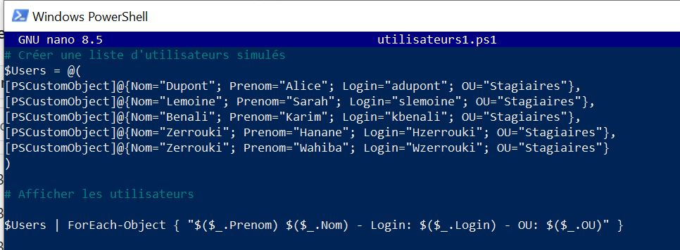 

On aura le résultat suivant:

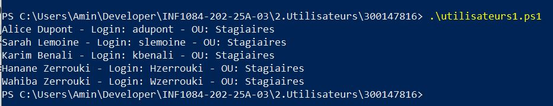

### 2. Deuxième Script : utilisateurs2.ps1
**Objectif** : Créer et gérer les groupes

**A faire** :

- Exécutez le script suivant dans PowerShell:

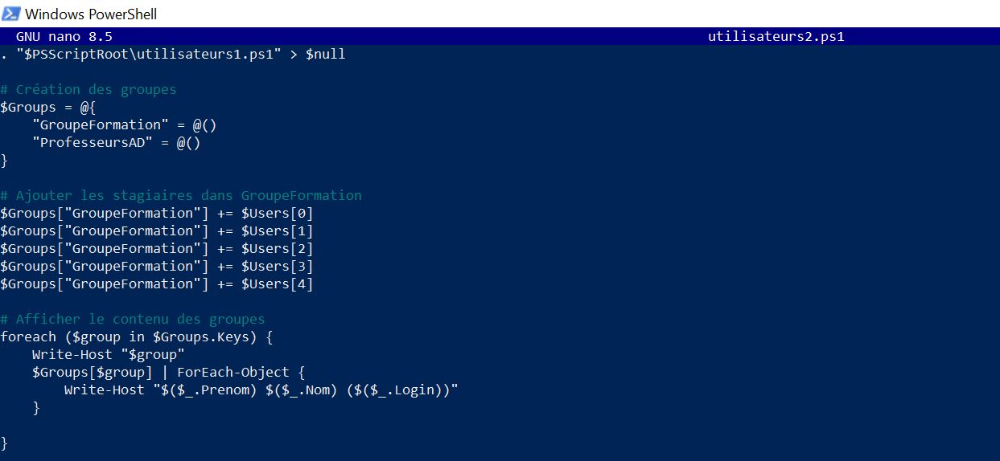

On aura le résultat suivant:

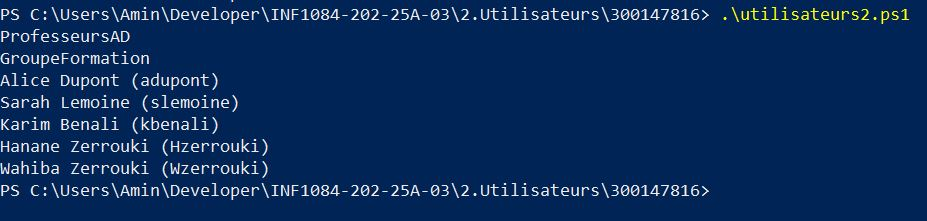

### 3. troisième script : utilisateurs3.ps1
**Objectif** : filtrage et recherche

• Filtrage des utilisateurs par nom commençant par "B"

• Filtrage par unité organisationnelle (OU)

• Recherche d'utilisateurs avec certaines lettres dans le prénom

**A faire**:

- Exécutez le script suivant dans PowerShell:

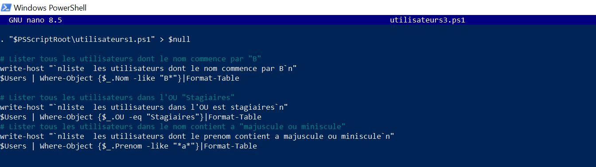

On aura le résultat suivant:

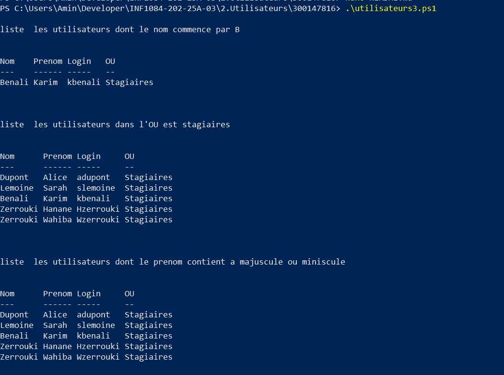

### 4. Quatriéme script : utilisateurs4.ps1
**Objectif** : Import/Export CSV

• Export des données utilisateurs vers CSV

• Import des données depuis un fichier CSV

• Création de groupes à partir des données importées

**A faire**:
- Exécutez le script suivant dans PowerShell:

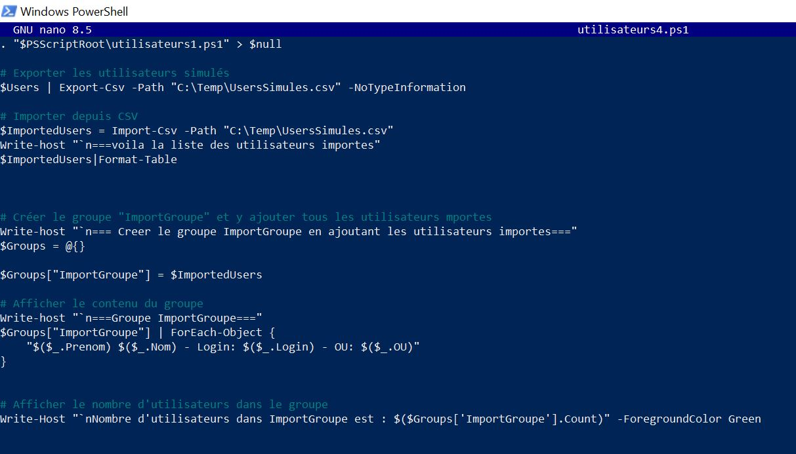

On aura le résultat suivant:

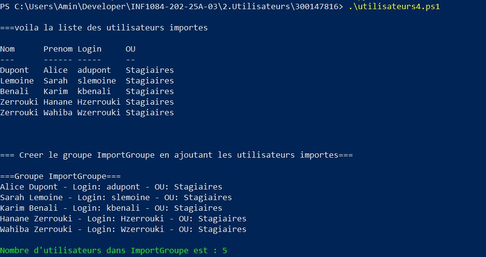

### 5. Cinquième script : Mini-projet_300147816.ps1
**Objectif**

• Création d'une promotion d'étudiants 2025

• Gestion du groupe "Etudiants2025"

• Export/Import complet des données

• Statistiques sur le groupe

**A faire**:
- Exécutez le script suivant dans PowerShell:

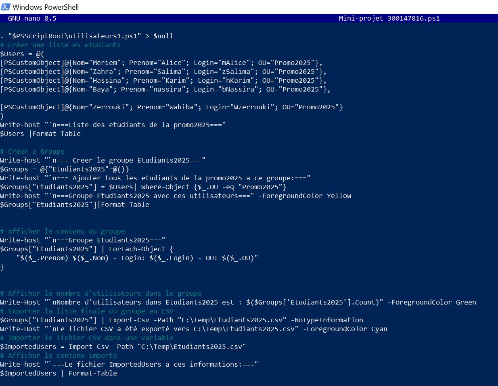

On aura le résultat suivant:

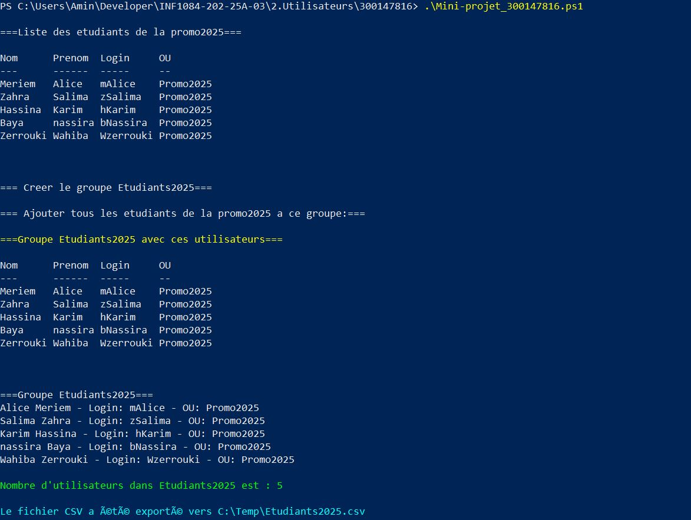
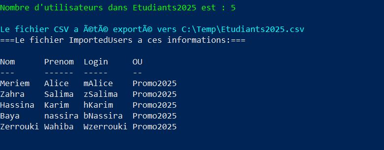

**Résultats Obtenu:**

üß® Statistiques des Groupes: 

‚Åé GroupeFormation : 5 utilisateurs

‚Åé ImportGroupe : 5 utilisateurs

‚Åé Etudiants2025 : 5 utilisateurs

🧨 Fichiers Générés:

• C:\Temp\UsersSimules.csv - Liste complète des utilisateurs

• C:\Temp\Etudiants2025.csv - Groupe des étudiants 2025

## Commandes PowerShell Utilisées

| Commande | Utilisation |
|----------|-------------|
| `PSCustomObject` | Création d'objets personnalisés |
| `Where-Object` | Filtrage des données |
| `Format-Table` | Affichage tabulaire |
| `Export-Csv` | Export vers CSV |
| `Import-Csv` | Import depuis CSV |
| `ForEach-Object` | Itération sur les collections |

(⓿_⓿) **Instructions d'Exécution**

• Prérequis : PowerShell 5.0 ou supérieur

• Droits : Exécution avec droits suffisants pour écrire dans C:\Temp

• Exécution : Lancer les scripts dans l'ordre : en tapant les commandes suivantes:

.\utilisateurs1.ps1

.\utilisateurs2.ps1

.\utilisateurs3.ps1

.\utilisateurs4.ps1
.\Mini-projet_300147816.ps1

🎀🎀 Objectifs de mon travail:

En faisant ce travail, j'ai appris:

• La maîtrise de la manipulation d'objets PowerShell

• L'Import/Export de données structurées

• Le filtrage et la recherche avancée

• La gestion des groupes d'utilisateurs
