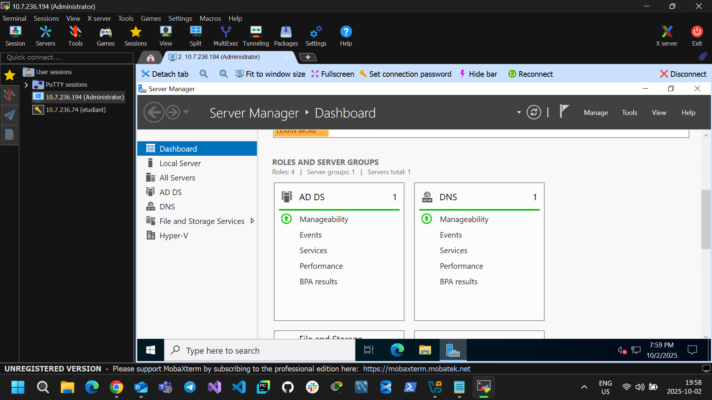

# 300133071

* J'ai renommer le nom de la machine

```powershell
Rename-Computer -NewName "DC300133071" -Restart
```
```powershell
DC300133071
```

* J'installe Active Directory

```powershell
Install-WindowsFeature AD-Domain-Services -IncludeManagementTools
```
```powershell
Success Restart Needed Exit Code      Feature Result
------- -------------- ---------      --------------
True    No             Success        {Active Directory Domain Services, Group P...
```

* J'ajoute une nouvelle foret a mon AD

```powershell
Install-ADDSForest `
    -DomainName "DC300133071-00.local" `
    -DomainNetbiosName "DC300133071-00" `
    -InstallDns:$true `
    -SafeModeAdministratorPassword (ConvertTo-SecureString "Cameroon2️⃣0️⃣2️⃣4️⃣&" -AsPlainText -Force) `
    -Force
```

* je me connect a mon domaine avec le nom d'utilisateur ci dessous et le mot de passe de la VM

DC300133071-00\Administrator



* Je verifie que mon controlleur de donnaime est bien installer
  
```powershell
Get-ADDomain
```

```powershell
AllowedDNSSuffixes                 : {}
ChildDomains                       : {}
ComputersContainer                 : CN=Computers,DC=DC300133071-00,DC=local
DeletedObjectsContainer            : CN=Deleted Objects,DC=DC300133071-00,DC=local
DistinguishedName                  : DC=DC300133071-00,DC=local
DNSRoot                            : DC300133071-00.local
DomainControllersContainer         : OU=Domain Controllers,DC=DC300133071-00,DC=local
DomainMode                         : Windows2016Domain
DomainSID                          : S-1-5-21-447135690-91861430-3213525697
ForeignSecurityPrincipalsContainer : CN=ForeignSecurityPrincipals,DC=DC300133071-00,DC=local
Forest                             : DC300133071-00.local
InfrastructureMaster               : DC300133071.DC300133071-00.local
LastLogonReplicationInterval       :
LinkedGroupPolicyObjects           : {CN={31B2F340-016D-11D2-945F-00C04FB984F9},CN=Policies,CN=System,DC=DC300133071-00
                                     ,DC=local}
LostAndFoundContainer              : CN=LostAndFound,DC=DC300133071-00,DC=local
ManagedBy                          :
Name                               : DC300133071-00
NetBIOSName                        : DC300133071-00
ObjectClass                        : domainDNS
ObjectGUID                         : 503edc1a-90a5-4179-bc97-ee138a9f1da1
ParentDomain                       :
PDCEmulator                        : DC300133071.DC300133071-00.local
PublicKeyRequiredPasswordRolling   : True
QuotasContainer                    : CN=NTDS Quotas,DC=DC300133071-00,DC=local
ReadOnlyReplicaDirectoryServers    : {}
ReplicaDirectoryServers            : {DC300133071.DC300133071-00.local}
RIDMaster                          : DC300133071.DC300133071-00.local
SubordinateReferences              : {DC=ForestDnsZones,DC=DC300133071-00,DC=local,
                                     DC=DomainDnsZones,DC=DC300133071-00,DC=local,
                                     CN=Configuration,DC=DC300133071-00,DC=local}
SystemsContainer                   : CN=System,DC=DC300133071-00,DC=local
UsersContainer                     : CN=Users,DC=DC300133071-00,DC=local
```
```powershell
Get-ADForest
```

```powershell
ApplicationPartitions : {DC=DomainDnsZones,DC=DC300133071-00,DC=local, DC=ForestDnsZones,DC=DC300133071-00,DC=local}
CrossForestReferences : {}
DomainNamingMaster    : DC300133071.DC300133071-00.local
Domains               : {DC300133071-00.local}
ForestMode            : Windows2016Forest
GlobalCatalogs        : {DC300133071.DC300133071-00.local}
Name                  : DC300133071-00.local
PartitionsContainer   : CN=Partitions,CN=Configuration,DC=DC300133071-00,DC=local
RootDomain            : DC300133071-00.local
SchemaMaster          : DC300133071.DC300133071-00.local
Sites                 : {Default-First-Site-Name}
SPNSuffixes           : {}
UPNSuffixes           : {}
```
