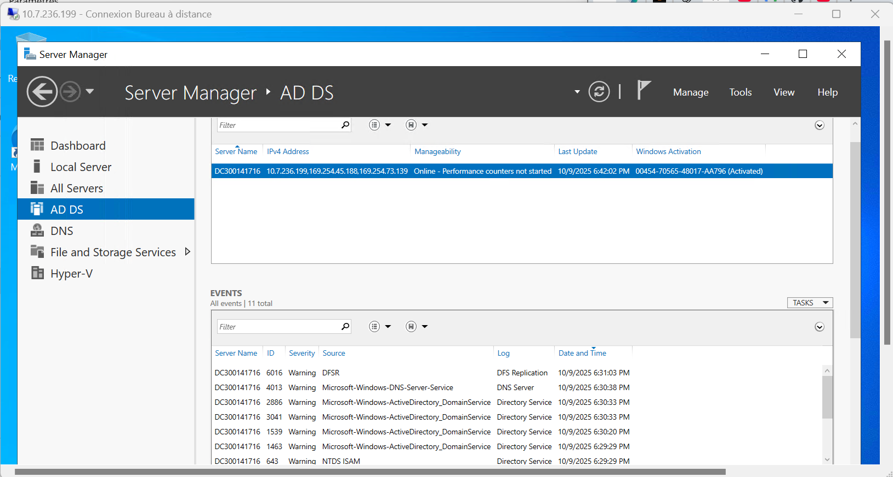

# 300141716

* J'ai renommé le nom de la machine

```powershell
Rename-Computer -NewName "DC300141716" -Restart
```
J'installe Active Directory
```powershell
Install-WindowsFeature AD-Domain-Services -IncludeManagementTools
```
<details> 
    <summary>Output</summary>
```powershell

Success Restart Needed Exit Code      Feature Result
------- -------------- ---------      --------------
True    No             NoChangeNeeded {}
</details>
```
*J'ajoute une nouvelle forêt à mon AD

```powershell

Install-ADDSForest `
    -DomainName "DC300141716-00.local" `
    -DomainNetbiosName "DC300141716-00" `
    -InstallDns:$true `
    -SafeModeAdministratorPassword (ConvertTo-SecureString "Maroc@2025" -AsPlainText -Force) `
    -Force
```
*Je me connecte à mon domaine avec le nom d'utilisateur ci-dessous et le mot de passe de la VM

DC300141716-00\Administrator

Vous verrez les services installés ainsi que le DNS comme sur l'image.

*Je vérifie que mon contrôleur de domaine est bien installé

```powershell

Get-ADDomain
```
<details> 
    <summary>Output</summary>
```powershell
AllowedDNSSuffixes                 : {}
ChildDomains                       : {}
ComputersContainer                 : CN=Computers,DC=DC300141716-00,DC=local
DeletedObjectsContainer            : CN=Deleted Objects,DC=DC300141716-00,DC=local
DistinguishedName                  : DC=DC300141716-00,DC=local
DNSRoot                            : DC300141716-00.local
DomainControllersContainer         : OU=Domain Controllers,DC=DC300141716-00,DC=local
DomainMode                         : Windows2016Domain
DomainSID                          : S-1-5-21-...
Forest                             : DC300141716-00.local
InfrastructureMaster               : DC300141716.DC300141716-00.local
LastLogonReplicationInterval       :
LinkedGroupPolicyObjects           : {CN={31B2F340-016D-11D2-945F-00C04FB984F9},CN=Policies,CN=System,DC=DC300141716-00,DC=local}
LostAndFoundContainer              : CN=LostAndFound,DC=DC300141716-00,DC=local
ManagedBy                          :
Name                               : DC300141716-00
NetBIOSName                        : DC300141716-00
ObjectClass                        : domainDNS
    ```
</details>
```powershell
Get-ADForest
```
<details> 
    <summary>Output</summary>
```powershell

ApplicationPartitions : {DC=DomainDnsZones,DC=DC300141716-00,DC=local, DC=ForestDnsZones,DC=DC300141716-00,DC=local}
CrossForestReferences : {}
DomainNamingMaster    : DC300141716.DC300141716-00.local
Domains               : {DC300141716-00.local}
ForestMode            : Windows2016Forest
GlobalCatalogs        : {DC300141716.DC300141716-00.local}
Name                  : DC300141716-00.local
PartitionsContainer   : CN=Partitions,CN=Configuration,DC=DC300141716-00,DC=local
RootDomain            : DC300141716-00.local
SchemaMaster          : DC300141716.DC300141716-00.local
Sites                 : {Default-First-Site-Name}
SPNSuffixes           : {}
UPNSuffixes           : {}
```
</details> 
