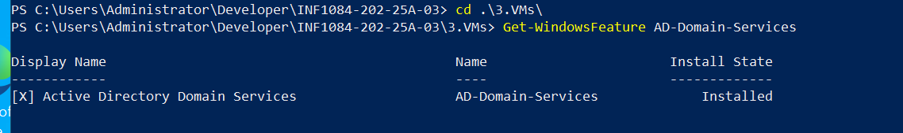
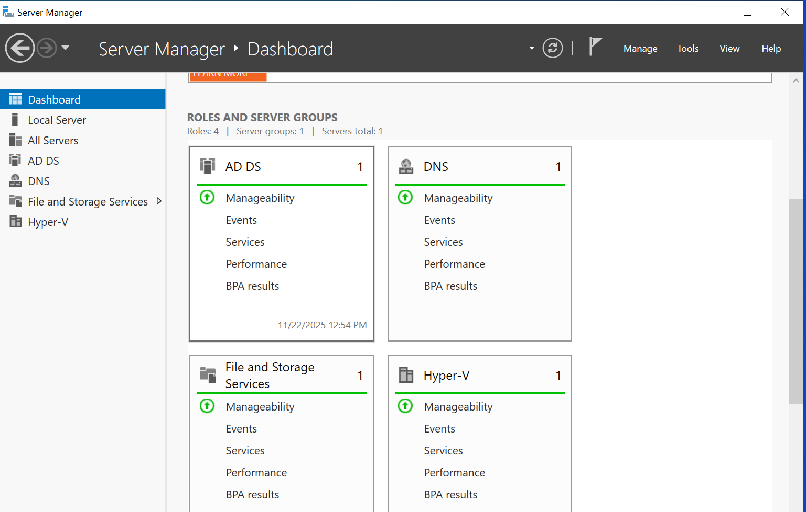
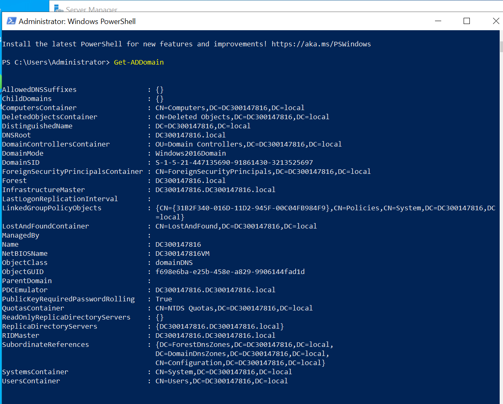
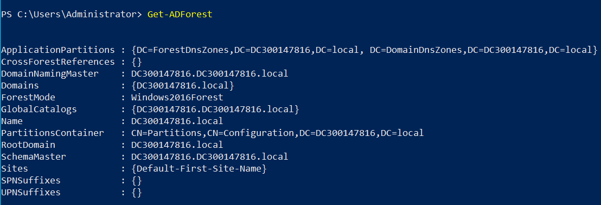

Voila mon README -300147816-

**Etape 01:** J'ai renomme le nom de serveur:
```powershell
Rename-Computer -NewName "DC300147816" -Restart
```
Le serveur va se redemarrer 

**Etape 02:** J'installe Active Directory:
```powershell
Install-WindowsFeature AD-Domain-Services -IncludeManagementTools
```
J'ai execute la commande suivante pour vérifier l'installation:


 
**Etape 03:** J'ajoute une nouvelle foret a mon Active Directory:
```powershell
Install-ADDSForest `
    -DomainName "DC300147816-00.local" `
    -DomainNetbiosName "DC300147816-00" `
    -InstallDns:$true `
    -SafeModeAdministratorPassword (ConvertTo-SecureString "Infra@2024" -AsPlainText -Force) `
    -Force
```
Enfin, je peux me connecter a mon domaine avec le nom d'utilisateur suivant: DC300147816-00\Administrator et le mot de passe de la machine virtuelle: INFRA@2024


Donc l'image confirme que le service est bien installe.

**Etape 04:** Je verifie que mon controlleur de domaine est bien installé en tapant les commandes suivantes:
```powershell
Get-ADDomain
```
On aura le resultat suivant:


 ```powershell
Get-ADForest
```
On aura le resultat suivant:


