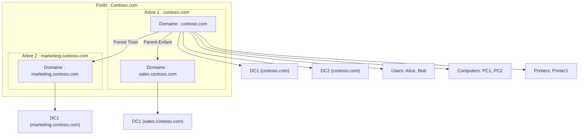

# 🎛️ DC Domain Controler

## :books: Travail à soumettre :

- [ ] Créer un répertoire avec ton  :id: (votre identifiant boreal)
  - [ ] `mkdir ` :id:
  - [ ] `cd ` :id:
- [ ] dans le répertoire ajouter le fichier `README.md`
  - [ ] `touch README.md`
  - [ ] Créer un répertoire images
  - [ ] `touch images/.gitkeep`
- [ ] envoyer vers le serveur `git`
  - [ ] remonter au repertoire précédent
        `cd ..`
  - [ ] `git add `:id:
  - [ ] `git commit -m "mon fichier ..."`
  - [ ] `git push`

## :a: Arborescence 



:warning: **Chaque étudiant a un domaine unique basé sur son numéro étudiant**.

Voici comment organiser ça et l’adapter à PowerShell :

---

## **1️⃣ Nom du domaine basé  sur le numéro étudiant**

Si ton numéro d’étudiant est `999999999` et que tu as le numéro d'instance `netbios` 30 (pour éviter les erreurs de duplicatas):

```powershell
$studentNumber = 999999999
$studentInstance = 00

$domainName = "DC$studentNumber-$studentInstance.local"
$netbiosName = "DC$studentNumber-$studentInstance"

Install-ADDSForest `
    -DomainName $domainName `
    -DomainNetbiosName $netbiosName `
    -InstallDns:$true `
    -SafeModeAdministratorPassword (ConvertTo-SecureString "MotDePasseDSRM123!" -AsPlainText -Force) `
    -Force
```

* **$domainName** : FQDN du domaine (`DC999999999-00.local`)
* **$netbiosName** : Nom NetBIOS court (`DC999999999-00`)
* Cela garantit **un nom unique pour chaque étudiant** même si plusieurs étudiants font le TP sur le même réseau isolé.

---

## **2️⃣ Ajouter un DC enfant ou sous-domaine pour TP avancé**

```powershell
# Exemple : créer un domaine enfant “sales” dans ton domaine étudiant
Install-ADDSDomain `
    -NewDomainName "sales" `
    -ParentDomainName $domainName `
    -DomainNetbiosName "SALES$studentNumber$studentInstance" `
    -InstallDns:$true `
    -SafeModeAdministratorPassword (ConvertTo-SecureString "MotDePasseDSRM123!" -AsPlainText -Force) `
    -Force
```

* `SALES99999999900` devient le NetBIOS du sous-domaine pour l’étudiant 999999999-00.

---

## **3️⃣ Création automatique des utilisateurs pour TP**

```powershell
# Créer un utilisateur “Alice” pour cet étudiant
New-ADUser -Name "Alice Dupont" `
           -GivenName "Alice" `
           -Surname "Dupont" `
           -SamAccountName "alice.dupont" `
           -UserPrincipalName "alice.dupont@$domainName" `
           -AccountPassword (ConvertTo-SecureString "MotDePasse123!" -AsPlainText -Force) `
           -Enabled $true
```

---

## ✅ **Résumé des bonnes pratiques pour TP étudiant**

1. **Numéro étudiant + instance** → nom de domaine unique.
2. **Installer le DNS intégré** pour éviter les conflits avec le réseau réel.
3. **Isoler les VM sur un réseau interne** (Hyper-V/VMware/VirtualBox).
4. **Scripts PowerShell multi-lignes** pour lisibilité.
5. Créer des OU, groupes et utilisateurs directement avec le numéro étudiant pour éviter les collisions.

