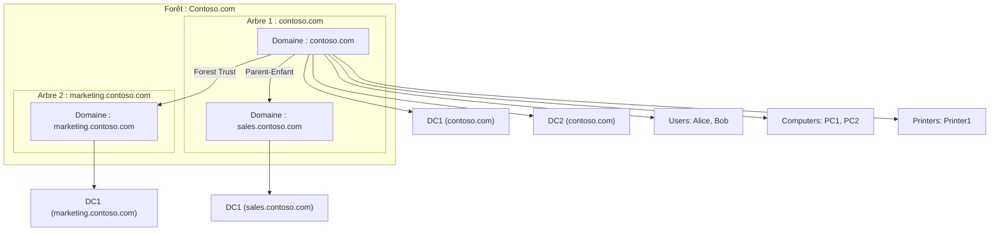

# 🎛️ DC Domain Controler

```mermaid
flowchart TD
    %% Forêt
    subgraph FOREST1["Forêt : Contoso.com"]
        direction TB
        
        %% Arbre 1
        subgraph TREE1["Arbre 1 : contoso.com"]
            direction TB
            DOMAIN1["Domaine : contoso.com"]
            DOMAIN2["Domaine : sales.contoso.com"]
        end
        
        %% Arbre 2
        subgraph TREE2["Arbre 2 : marketing.contoso.com"]
            direction TB
            DOMAIN3["Domaine : marketing.contoso.com"]
        end
    end

    %% Contrôleurs de domaine
    DOMAIN1_DC1["DC1 (contoso.com)"]
    DOMAIN1_DC2["DC2 (contoso.com)"]
    DOMAIN2_DC1["DC1 (sales.contoso.com)"]
    DOMAIN3_DC1["DC1 (marketing.contoso.com)"]

    %% Objets AD dans un domaine
    DOMAIN1_USERS["Users: Alice, Bob"]
    DOMAIN1_COMPUTERS["Computers: PC1, PC2"]
    DOMAIN1_PRINTERS["Printers: Printer1"]

    %% Approbations (trusts)
    DOMAIN1 -->|Parent-Enfant| DOMAIN2
    DOMAIN1 -->|Forest Trust| DOMAIN3

    %% Liaisons DC <-> Domaines
    DOMAIN1 --> DOMAIN1_DC1
    DOMAIN1 --> DOMAIN1_DC2
    DOMAIN2 --> DOMAIN2_DC1
    DOMAIN3 --> DOMAIN3_DC1

    %% Liaisons Objets -> Domaine
    DOMAIN1 --> DOMAIN1_USERS
    DOMAIN1 --> DOMAIN1_COMPUTERS
    DOMAIN1 --> DOMAIN1_PRINTERS

```
