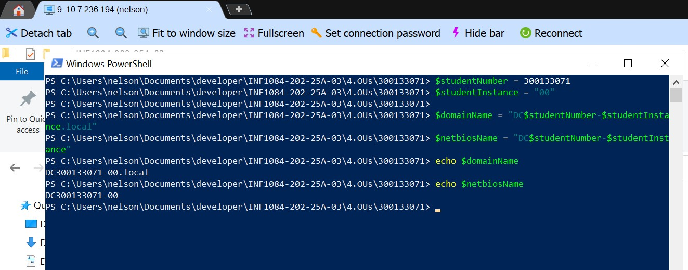
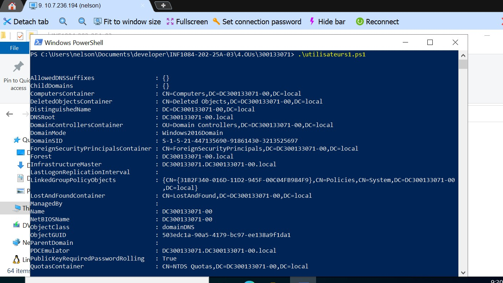
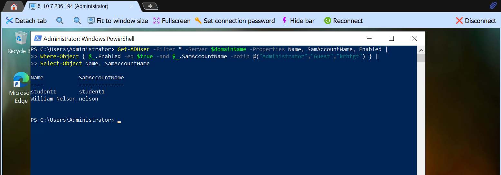
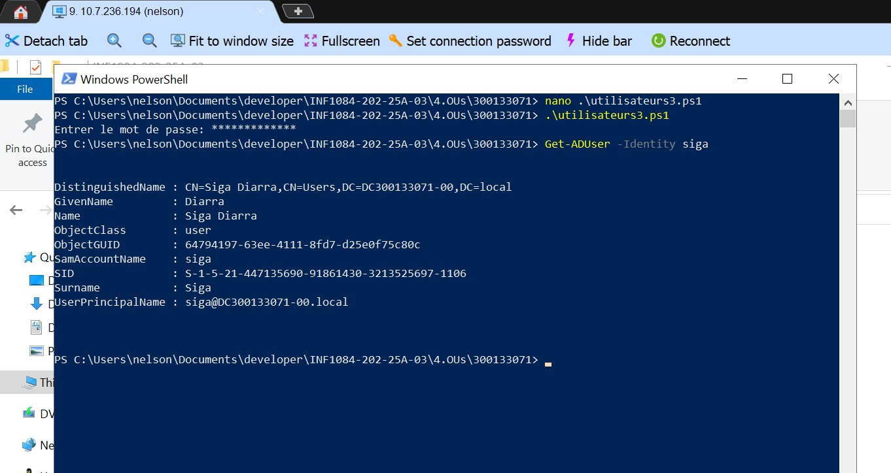
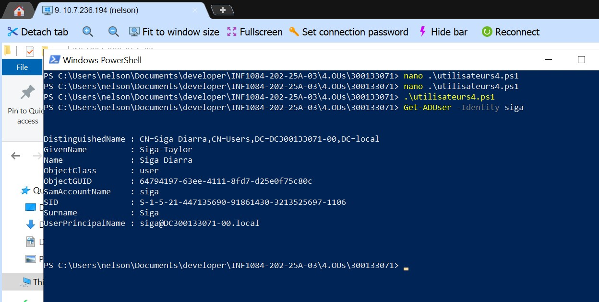
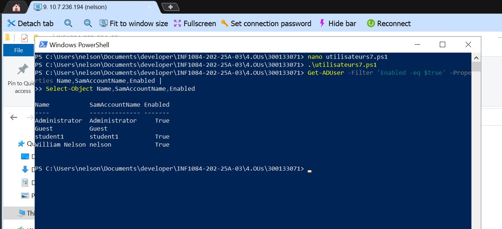
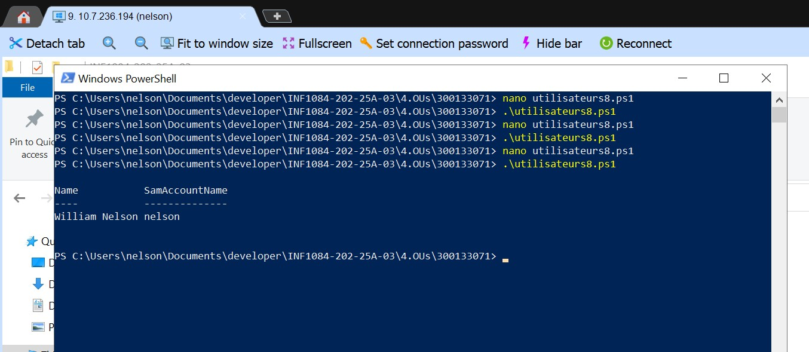
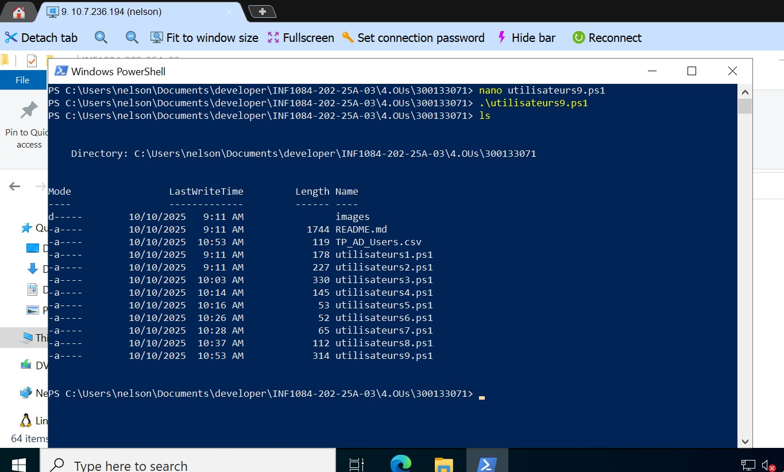

# 300133071

# 0️⃣ Nom du domaine basé sur le numéro étudiant



# 1️⃣ Préparer l’environnement



# 2️⃣ Liste des utilisateurs du domaine



# 3️⃣ Créer un nouvel utilisateur



# 4️⃣ Modifier un utilisateur



# 7️⃣ Supprimer un utilisateur



# 8️⃣ Rechercher des utilisateurs avec un filtre



# 9️⃣ Exporter les utilisateurs dans un CSV



# 🔟 Déplacer un utilisateur vers une OU Students


```powershell
Get-ADUser -Filter * -Server $domainName -Properties Name, SamAccountName, Enabled |
Where-Object { $_.Enabled -eq $true -and $_.SamAccountName -notin @("Administrator","Guest","krbtgt") } |
Select-Object Name, SamAccountName
```

je cree un utilisateur sur ma vm
```powershell

New-ADUser `
  -Name "William Nelson" `
  -GivenName "William" `
  -Surname "Nelson" `
  -SamAccountName "nelson" `
  -UserPrincipalName "nelson@DC300133071-00.local" `
  -Path "CN=Users,DC=DC300133071-00,DC=local" `
  -AccountPassword (Read-Host -AsSecureString "Entrer le mot de passe") `
  -Enabled $true
```

```powershell
Get-ADUser -Identity nelson : pour verifier
```
```powershell
(Get-ItemProperty -Path 'HKLM:\System\CurrentControlSet\Control\Terminal Server' -Name fDenyTSConnections).fDenyTSConnections
```
```powershell
Set-ItemProperty -Path 'HKLM:\System\CurrentControlSet\Control\Terminal Server' -Name fDenyTSConnections -Value 0
```
```powershell
Add-ADGroupMember -Identity "Remote Desktop Users" -Members "wnelson"
```
```powershell
Get-ADGroupMember "Remote Desktop Users"
```
```txt
Sur le serveur :

Ouvre secpol.msc (→ menu Démarrer → tape secpol.msc)

Va dans :
Local Policies → User Rights Assignment → Allow log on through Remote Desktop Services

Assure-toi que le groupe Remote Desktop Users (et/ou ton utilisateur) y figure.
```
