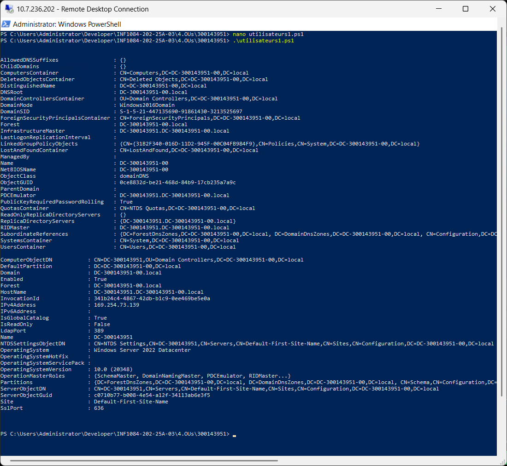
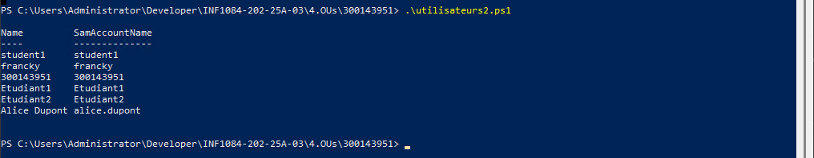
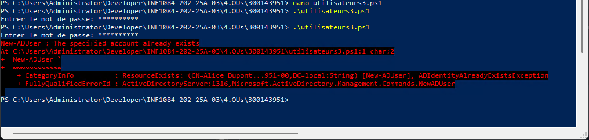
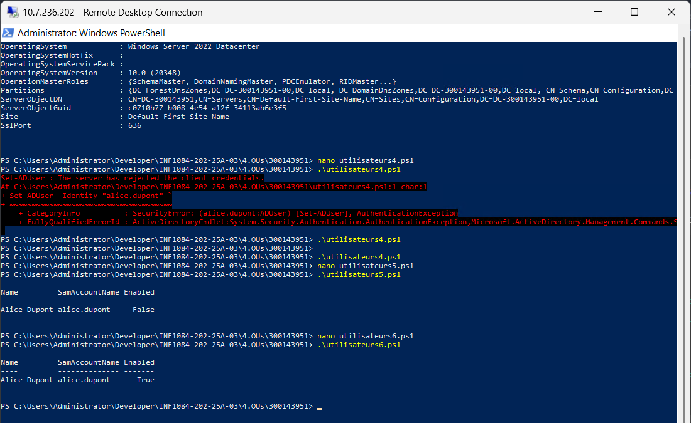
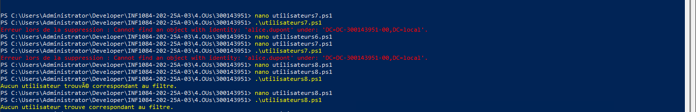
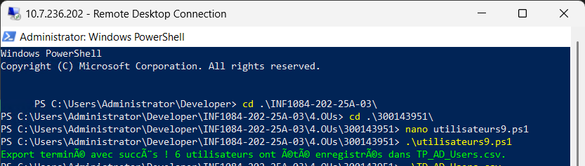
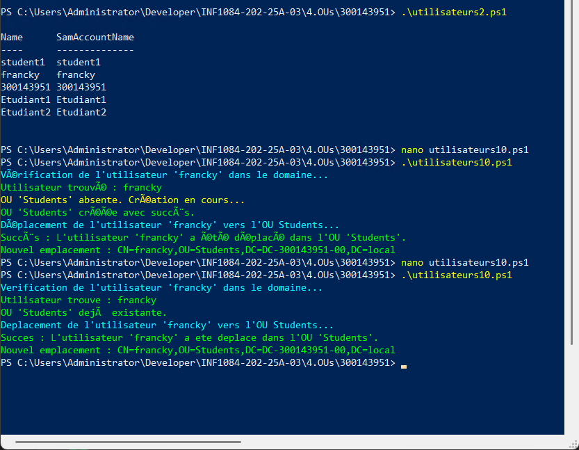

# Gestion des Utilisateurs Active Directory avec PowerShell

## 📋 Informations du Projet

**Étudiant:** 300143951  
**Domaine:** DC-300143951-00.local  
**NetBIOS:** DC-300143951-00

## 🔧 Configuration Initiale

### Fichier `bootstrap.ps1`

Créez ce fichier avec vos informations de connexion :

```powershell
# Informations de l'étudiant
$studentNumber = 300143951
$studentInstance = 00

# Noms du domaine
$domainName = "DC$studentNumber-$studentInstance.local"
$netbiosName = "DC$studentNumber-$studentInstance"

# Identifiants administrateur
$plain = 'Infra@2024'
$secure = ConvertTo-SecureString $plain -AsPlainText -Force
$cred = New-Object System.Management.Automation.PSCredential("Administrator@$domainName", $secure)
```


## 🔧 Scripts et Opérations

### 1️⃣ Préparation de l'Environnement

**Fichier:** `utilisateurs1.ps1`

**Résultat:**
- ✓ Module importé
- ✓ Domaine vérifié
- ✓ Contrôleurs de domaine listés



---

### 2️⃣ Liste des Utilisateurs

**Fichier:** `utilisateurs2.ps1`

**Utilisateurs trouvés:**
- student1
- francky
- 300143951
- Etudiant1
- Etudiant2
- Alice Dupont



---

### 3️⃣ Créer un Nouvel Utilisateur

**Fichier:** `utilisateurs3.ps1`


**Résultat:** 
- alice.dupon existait deja
- Gestion des erreurs: Message clair si l'utilisateur existe déjà



---

### 4️⃣ Modifier, Désactiver et Réactiver

**Fichiers:** `utilisateurs4.ps1`, `utilisateurs5.ps1`, `utilisateurs6.ps1`

**4. Modifier un utilisateur:**

**5. Désactiver un utilisateur:**

**6. Réactiver un utilisateur:**

**Résultats:**
- Modification: ✓ Réussi
- Désactivation: Enabled = **False** ✓
- Réactivation: Enabled = **True** ✓



---

### 5️⃣ Supprimer et Filtrer

**Fichiers:** `utilisateurs7.ps1`, `utilisateurs8.ps1`

**7. Supprimer un utilisateur:**
alice dupon avait ete suprime prealablement resont pour laquelle cella affiche un message d'erreur progtammee

**8. Filtrer les utilisateurs:**
pas d'utilisateurs commancant par "A"

**Résultats:**
- Suppression: ✓ Utilisateur supprimé
- Filtrage: Affiche tous les utilisateurs dont le prénom commence par 'A'



---

### 6️⃣ Exporter les Utilisateurs (CSV)

**Fichier:** `utilisateurs9.ps1`


**Résultat:**
- ✓ Export terminé avec succès
- 6 utilisateurs enregistrés dans **TP_AD_Users.csv**



---

### 7️⃣ Déplacer Utilisateur vers OU Students

**Fichier:** `utilisateurs10.ps1`

**Résultat:**
- ✓ OU 'Students' créée
- ✓ Utilisateur 'francky' déplacé vers OU=Students
- Nouvel emplacement: `CN=francky,OU=Students,DC=DC-300143951-00,DC=local
- SCript renvoyant un message en cas de reussite ou d'echec a chaques etapes du procesus `



---

## 📈 Résumé des Opérations

| # | Opération | Fichier | Statut |
|---|-----------|---------|--------|
| **1** | Préparation environnement | utilisateurs1.ps1 | ✓ |
| **2** | Lister utilisateurs | utilisateurs2.ps1 | ✓ |
| **3** | Créer utilisateur | utilisateurs3.ps1 | ✓ |
| **4** | Modifier utilisateur | utilisateurs4.ps1 | ✓ |
| **5** | Désactiver utilisateur | utilisateurs5.ps1 | ✓ |
| **6** | Réactiver utilisateur | utilisateurs6.ps1 | ✓ |
| **7** | Supprimer utilisateur | utilisateurs7.ps1 | ✓ |
| **8** | Filtrer utilisateurs | utilisateurs8.ps1 | ✓ |
| **9** | Exporter CSV | utilisateurs9.ps1 | ✓ |
| **10** | Déplacer vers OU | utilisateurs10.ps1 | ✓ |

---

## 🎓 Compétences Développées

✅ Gestion CRUD des utilisateurs Active Directory  
✅ PowerShell avancé (variables, filtres, cmdlets)  
✅ Gestion des Organizational Units (OUs)  
✅ Export et manipulation de données (CSV)  
✅ Vérification et validation des opérations  
✅ Gestion des erreurs et confirmations  
✅ Scripting PowerShell professionnel  

---

## 📁 Fichiers du Projet

**Scripts PowerShell:**
```
utilisateurs1.ps1   → Préparation
utilisateurs2.ps1   → Liste
utilisateurs3.ps1   → Création
utilisateurs4.ps1   → Modification
utilisateurs5.ps1   → Désactivation
utilisateurs6.ps1   → Réactivation
utilisateurs7.ps1   → Suppression
utilisateurs8.ps1   → Filtrage
utilisateurs9.ps1   → Export CSV
utilisateurs10.ps1  → Déplacement OU
```

**Données Exportées:**
```
TP_AD_Users.csv     → 16 utilisateurs
```

**Images:**
```
images/utilisateurs1.png   → Étape 1
images/utilisateurs2.png   → Étape 2
images/utilisateurs3.png   → Étape 3
images/utilisateurs456.png → Étapes 4, 5, 6
images/utilisateurs78.png  → Étapes 7, 8
images/utilisateurs9.png   → Étape 9
images/utilisateurs10.png  → Étape 10
```

---

## ✨ Conclusion

Tous les objectifs du TP ont été atteints avec succès. Les opérations CRUD (Create, Read, Update, Delete) sur les utilisateurs Active Directory sont maîtrisées, testées et documentées. Les scripts sont réutilisables et peuvent servir de base pour des projets futurs d'administration AD.


