**Gestion Active Directory - INF1084**

😊 **Informations du Projet**

Ce projet contient des scripts PowerShell pour la gestion d'Active Directory dans le cadre du cours INF1084.

↝**Informations d'etudiant**

- Numero d'etudiant : 300147816

- Instance : 25A-03

- Domaine : DC300147816.local

- Nom NetBIOS : DC300147816

😀Scripts Disponibles:

**0. Configuration Initiale (bootstrap.ps1):**

On cree ce fichier en tapant la commande: nano bootstrap.ps1

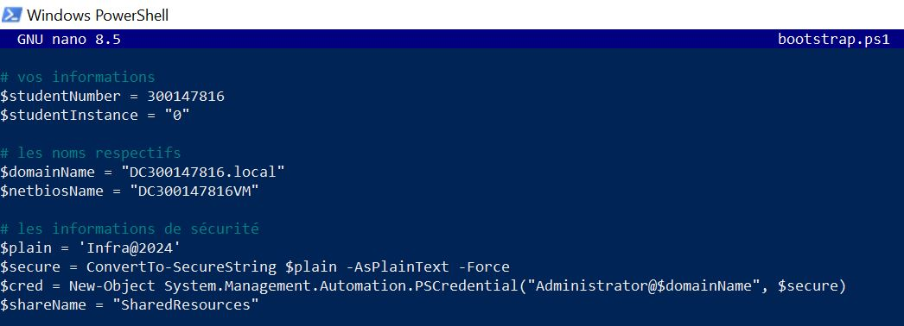

- Definit les variables du domaine

- Configure les informations de securite

👵 **Operations néscessitant les informations sécurisées de l'administrateur:**
```powershell
$cred = Get-Credential 
```
**1. Vérification Domaine (utilisateurs1.ps1)**

Voici le code de fichier utilisateurs1.ps1:

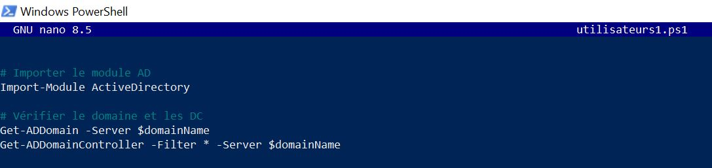

On aura a l'execution :


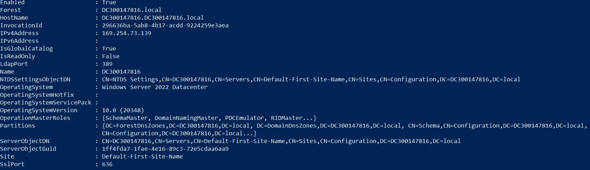

**2. Liste des utilisateurs du domaine**

Voici le code de fichier utilisateurs2.ps1:

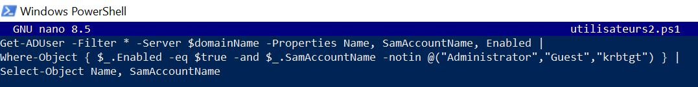

On aura a l'execution:

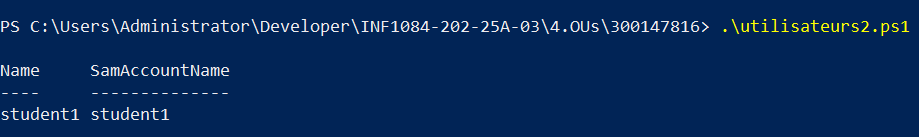

**3. Créer un nouvel utilisateur**

Voici le code de fichier utilisateurs3.ps1:

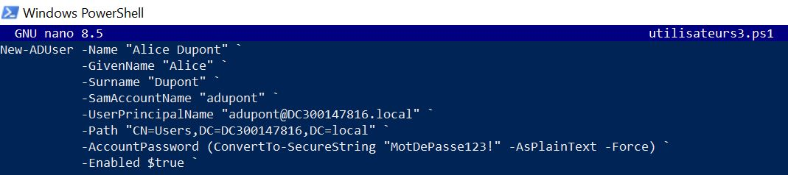

Si on execute de nouveau le fichier utilisateurs2.ps1, on aura ce resultat:

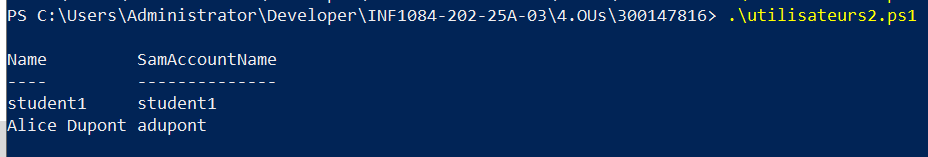

 On peut afficher les informations de cet utilisateur cree avec :


**4. Modifier un utilisateur**

Voici le code de fichier utilisateurs4.ps1:

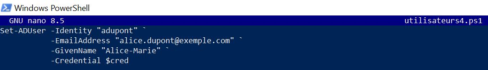

On peut verifier que la modification est bien faite en executant la commande suivante:

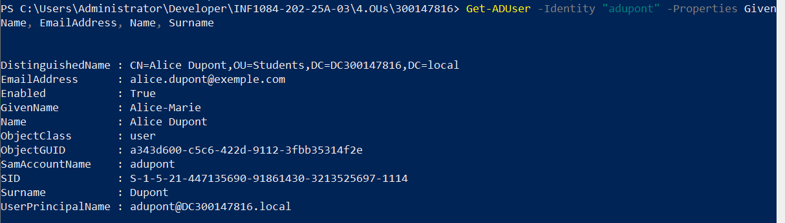
 
On voit tres bien que le GivenName est devenue : **Alice-Marie**

**5. Désactiver un utilisateur**

Voici le code de fichier utilisateurs5.ps1:

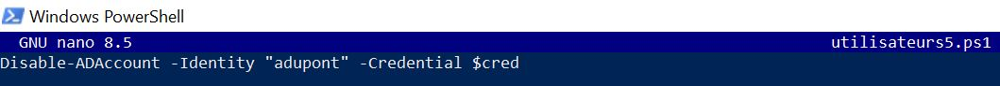

On peut verifier que l'utilisateur est bien desactive en executant la commande suivante:

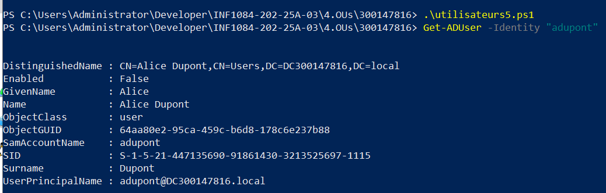

**6. Réactiver un utilisateur**

Voici le code de fichier utilisateurs6.ps1:

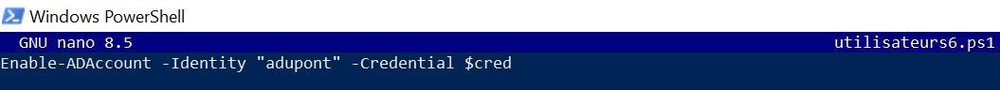

On peut verifier que l'utilisateur est bien reactive en executant la commande suivante:

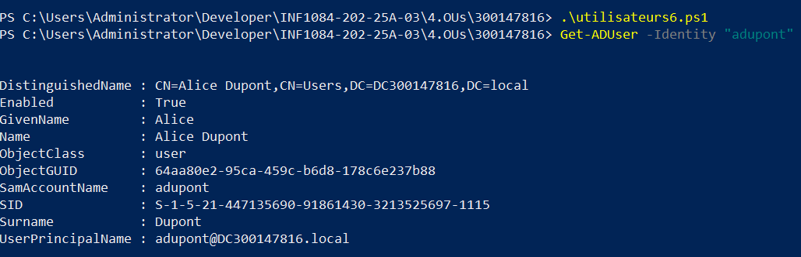

**7. Supprimer un utilisateur**

Voici le code de fichier utilisateurs7.ps1:

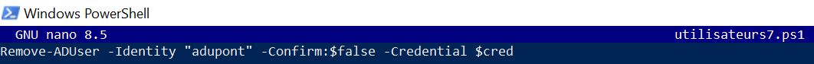

On peut verifier que l'utilisateur est bien supprime en executant de nouveau le fichier utilisateurs2.ps1:

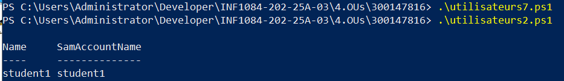

**8. Rechercher des utilisateurs avec un filtre**

Voici le code de fichier utilisateurs8.ps1:

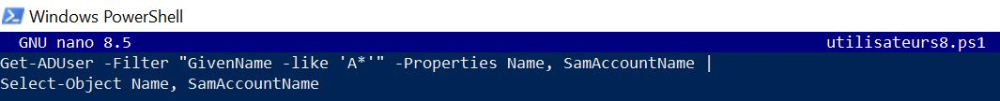

Vu qu'on a supprime l'utilisateur dans le fichier utilisateurs7.ps1, on doit executer d'abord les commandes suivantes, puis on execute le fichier utilisateurs8.ps1:

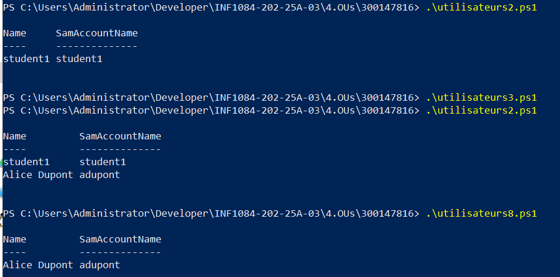

**9. Exporter les utilisateurs dans un CSV**

Dans cette étape, nous exportons la liste des utilisateurs du domaine Active Directory vers un fichier CSV afin de pouvoir les consulter facilement et les analyser. Voici le code de fichier utilisateurs9.ps1:

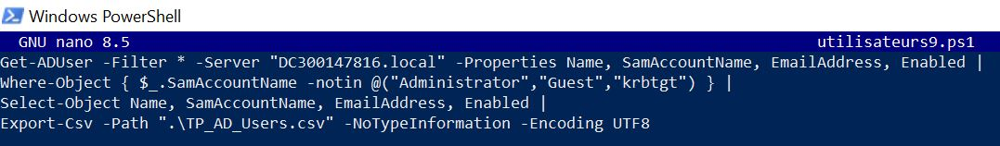

En executant ce code on aura un fichier TP_AD_Users.csv qui est créé dans le dossier courant.

Il contient la liste des utilisateurs du domaine, avec les colonnes :

- Name

- SamAccountName

- EmailAddress

- Enabled

L'image suivante confirme la creation de fichier TP_AD_Users.csv:

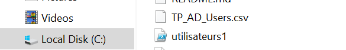

**10. Déplacer un utilisateur vers une OU Students**

Voici le code de fichier utilisateurs10.ps1:

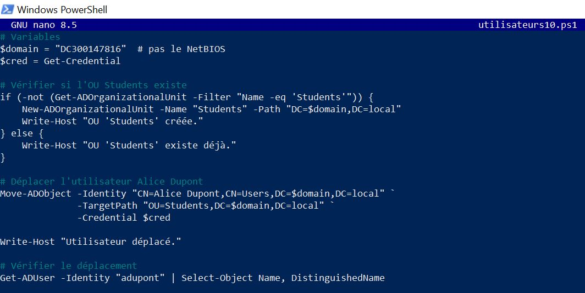

On aura a l'execution:

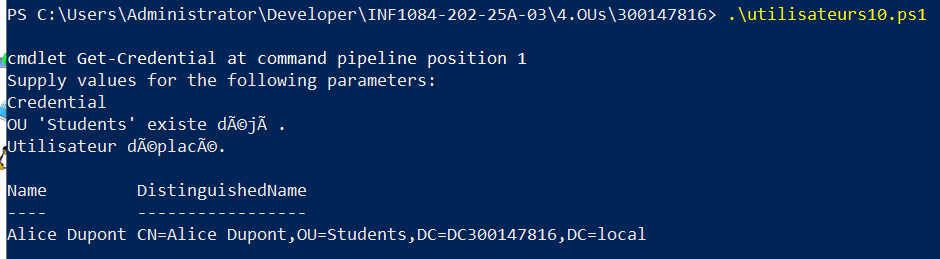
