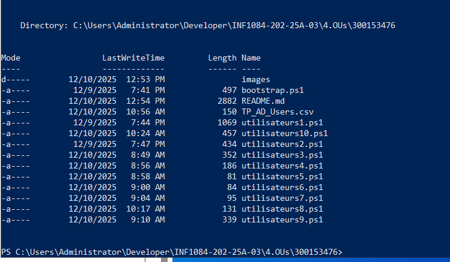
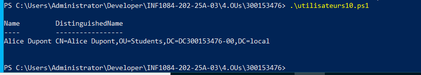

# 300153476

# 0️⃣ Nom du domaine basé sur le numéro étudiant

```powershell
$studentNumber = 300153476
$studentInstance = "00"
$domainName = "DC$studentNumber-$studentInstance.local"
$netbiosName = "DC$studentNumber-$studentInstance"
```


# 1️⃣ Préparer l’environnement

```powershell
# Importer le module AD
Import-Module ActiveDirectory
# Vérifier le domaine et les DC
Get-ADDomain -Server $domainName
Get-ADDomainController -Filter * -Server $domainName
```
 </img>
 </img>

# 2️⃣ Liste des utilisateurs du domaine

 </img>
 </img>

# 3️⃣ Créer un nouvel utilisateur

```powershell

New-ADUser `
    -Name "Alice Dupont" `
    -GivenName "Alice" `
    -Surname "Dupont" `
    -SamAccountName "alice.dupont" `
    -UserPrincipalName "alice.dupont@DC300153476-00.local" `
    -Path "CN=Users,DC=DC300153476-00,DC=local" `
    -AccountPassword (Read-Host -AsSecureString "Entrer le mot de passe") `
    -Enabled $true `
    -Credential $cred

```

 </img>

**4️⃣ Modifier un utilisateur**


**7️⃣ Supprimer un utilisateur**


# 8️⃣ Rechercher des utilisateurs avec un filtre
 </img>

# 9️⃣ Exporter les utilisateurs dans un CSV

 </img>

# 🔟 Déplacer un utilisateur vers une OU Students
 </img>


