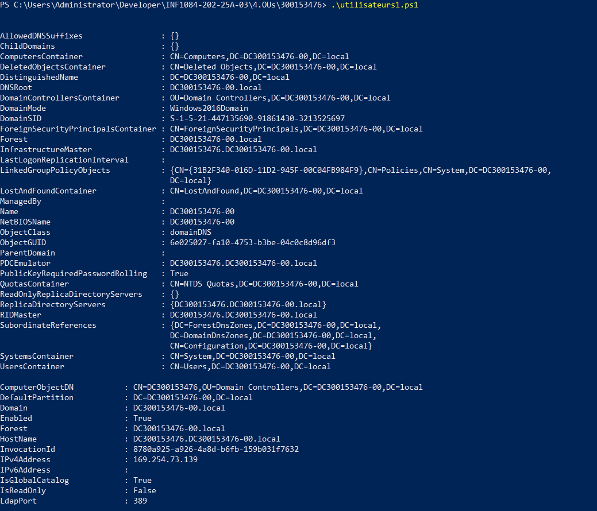
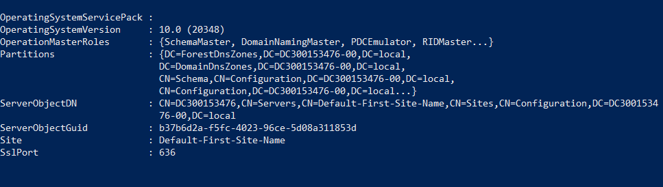
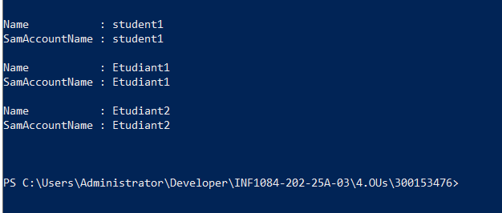
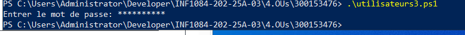
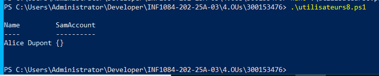

# 300153476

# 0️⃣ Nom du domaine basé sur le numéro étudiant

```powershell
$studentNumber = 300153476
$studentInstance = "00"
$domainName = "DC$studentNumber-$studentInstance.local"
$netbiosName = "DC$studentNumber-$studentInstance"
```



# 1️⃣ Préparer l’environnement

```powershell
# Importer le module AD
Import-Module ActiveDirectory
# Vérifier le domaine et les DC
Get-ADDomain -Server $domainName
Get-ADDomainController -Filter * -Server $domainName
```
 </img>
 </img>

# 2️⃣ Liste des utilisateurs du domaine

 </img>
 </img>

# 3️⃣ Créer un nouvel utilisateur

```powershell

New-ADUser `
    -Name "Alice Dupont" `
    -GivenName "Alice" `
    -Surname "Dupont" `
    -SamAccountName "alice.dupont" `
    -UserPrincipalName "alice.dupont@DC300153476-00.local" `
    -Path "CN=Users,DC=DC300153476-00,DC=local" `
    -AccountPassword (Read-Host -AsSecureString "Entrer le mot de passe") `
    -Enabled $true `
    -Credential $cred

```

 </img>

# 4️⃣ Modifier un utilisateur


# 7️⃣ Supprimer un utilisateur


# 8️⃣ Rechercher des utilisateurs avec un filtre
 </img>

# 9️⃣ Exporter les utilisateurs dans un CSV


# 🔟 Déplacer un utilisateur vers une OU Students
 </img>

# 🉐 Pour vous connecter avec un utilisateur creer vous devez :

1️⃣ verifier que la connexion RDP actif

```powershell
(Get-ItemProperty -Path 'HKLM:\System\CurrentControlSet\Control\Terminal Server' -Name fDenyTSConnections).fDenyTSConnections
```
```txt
1 c'est desactive 0 c'est active
```
2️⃣ activer RDP si c'est desactiver

```powershell
Set-ItemProperty -Path 'HKLM:\System\CurrentControlSet\Control\Terminal Server' -Name fDenyTSConnections -Value 0
```
3️⃣ ajouter votre utilisateur dans le groupe remote desktop users

```powershell
Add-ADGroupMember -Identity "Remote Desktop Users" -Members "wnelson"
```
```powershell
Get-ADGroupMember "Remote Desktop Users"
```
4️⃣ ouvrir l'executer avec 🪟➕```R``` puis

```txt
taoe secpol.msc (→ menu Démarrer → tape secpol.msc)

allez dans :
Local Policies → User Rights Assignment → Allow log on through Remote Desktop Services

Assure-toi que le groupe Remote Desktop Users (et/ou ton utilisateur) y figure.
```
