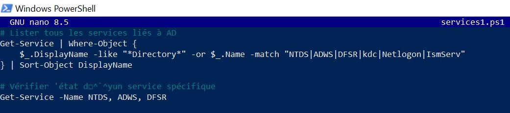
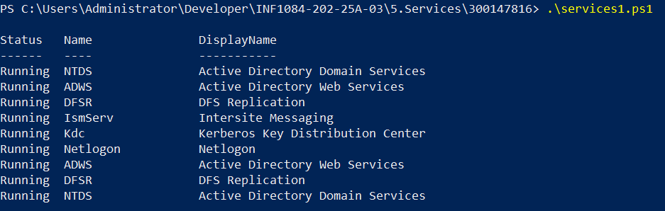
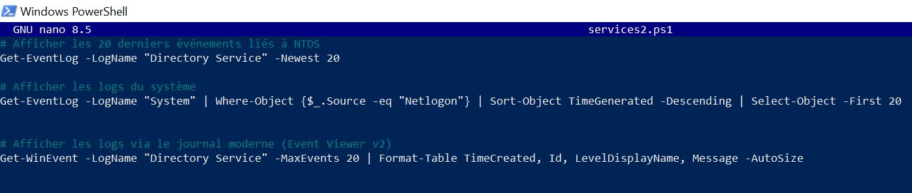
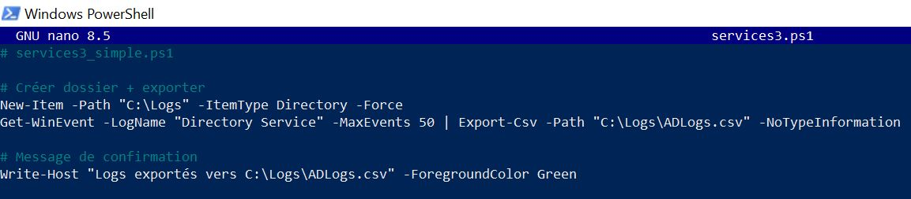
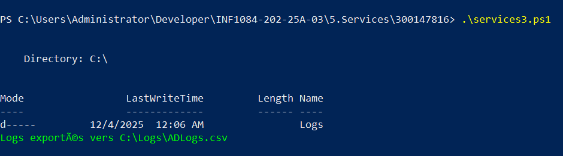
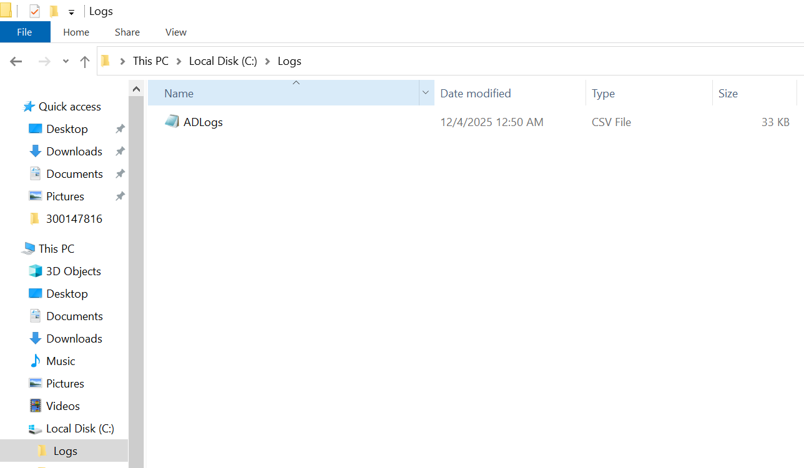
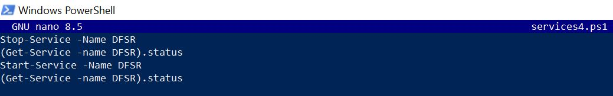
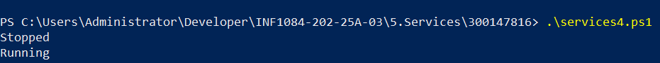

😋 **Activité 5 : Services Windows et AD DS**

🚋 **Description**

Ce projet contient quatre scripts PowerShell pour la gestion et l'analyse des services Windows,avec un focus particulier sur les services Active Directory Domain Services (AD DS). Ces scripts permettent de monitorer, diagnostiquer et gérer les services critiques d'un environnement Windows Server.

🧨 **Objectifs**

- Lister et analyser les services Active Directory

- Examiner les journaux d'événements AD

- Exporter les logs pour analyse externe

- Gérer les services critiques comme DFS Replication

🎉 **Fichiers:**

1. **services1.ps1 - Liste des services AD**

Description : Script qui identifie et liste tous les services liés à Active Directory sur un contrôleur de domaine.

Voila le fichier services1.ps1:



On aura a l'execution les services detectes suivants :



2. **services2.ps1 - Analyse des logs AD**

Description : Script d'analyse des journaux d'événements Active Directory pour le monitoring et le dépannage.

Voila le fichier services2.ps1:



On aura a l'execution: 

```powershell


   Index Time          EntryType   Source                 InstanceID Message
   ----- ----          ---------   ------                 ---------- -------
     760 Dec 03 22:54  Error       NTDS General           3221228446 The attribute value provided is not unique in the forest or partition....
     759 Dec 03 18:08  Information NTDS General           1073744851 Internal event: Online Defragment Start succeeded....
     758 Dec 03 18:08  Information NTDS General           1073744857 Internal event: Online Defragment Stop invoked but defrag was not running.
     757 Dec 03 18:08  Information NTDS ISAM                     701 NTDS (840,D,0) NTDSA: Online defragmentation has completed a full pass on database 'C:\Windows\NTDS\ntds.dit', freei...
     756 Dec 03 18:08  Information NTDS ISAM                     700 NTDS (840,D,0) NTDSA: Online defragmentation is beginning a full pass on database 'C:\Windows\NTDS\ntds.dit'.
     755 Dec 03 17:53  Information NTDS General           1073742986 Internal event: The Address Book hierarchy table has been rebuilt.
     754 Dec 03 17:53  Warning     NTDS General           2147486689 The security of this directory server can be significantly enhanced by configuring the server to enforce ...
     753 Dec 03 06:08  Information NTDS General           1073744851 Internal event: Online Defragment Start succeeded....
     752 Dec 03 06:08  Information NTDS General           1073744857 Internal event: Online Defragment Stop invoked but defrag was not running.
     751 Dec 03 06:08  Information NTDS ISAM                     701 NTDS (840,D,0) NTDSA: Online defragmentation has completed a full pass on database 'C:\Windows\NTDS\ntds.dit', freei...
     750 Dec 03 06:08  Information NTDS ISAM                     700 NTDS (840,D,0) NTDSA: Online defragmentation is beginning a full pass on database 'C:\Windows\NTDS\ntds.dit'.
     749 Dec 03 05:53  Information NTDS General           1073742986 Internal event: The Address Book hierarchy table has been rebuilt.
     748 Dec 02 18:08  Information NTDS General           1073744851 Internal event: Online Defragment Start succeeded....
     747 Dec 02 18:08  Information NTDS General           1073744857 Internal event: Online Defragment Stop invoked but defrag was not running.
     746 Dec 02 18:08  Information NTDS ISAM                     701 NTDS (840,D,0) NTDSA: Online defragmentation has completed a full pass on database 'C:\Windows\NTDS\ntds.dit', freei...
     745 Dec 02 18:08  Information NTDS ISAM                     700 NTDS (840,D,0) NTDSA: Online defragmentation is beginning a full pass on database 'C:\Windows\NTDS\ntds.dit'.
     744 Dec 02 17:53  Information NTDS General           1073742986 Internal event: The Address Book hierarchy table has been rebuilt.
     743 Dec 02 17:53  Warning     NTDS General           2147486689 The security of this directory server can be significantly enhanced by configuring the server to enforce ...
     742 Dec 02 06:08  Information NTDS General           1073744851 Internal event: Online Defragment Start succeeded....
     741 Dec 02 06:08  Information NTDS General           1073744857 Internal event: Online Defragment Stop invoked but defrag was not running.
   42751 Dec 02 14:26  Information NETLOGON                     5823 ...
   32499 Nov 02 04:10  Information NETLOGON                     5823 ...
   21558 Oct 02 18:54  Information NETLOGON                     5823 ...
   19274 Aug 29 14:08  Error       NETLOGON                     5719 This computer was not able to set up a secure session with a domain...
   18971 Aug 29 11:20  Error       NETLOGON                     5719 This computer was not able to set up a secure session with a domain...
   18709 Aug 29 11:12  Error       NETLOGON                     5719 This computer was not able to set up a secure session with a domain...
   18166 Aug 28 19:36  Error       NETLOGON                     5719 This computer was not able to set up a secure session with a domain...
   17011 Aug 28 17:56  Error       NETLOGON                     5719 This computer was not able to set up a secure session with a domain...
   16683 Aug 28 17:49  Error       NETLOGON                     5719 This computer was not able to set up a secure session with a domain...
   16361 Aug 28 16:34  Error       NETLOGON                     5719 This computer was not able to set up a secure session with a domain...
   15912 Aug 28 12:21  Error       NETLOGON                     5719 This computer was not able to set up a secure session with a domain...
   15713 Aug 28 12:17  Error       NETLOGON                     5719 This computer was not able to set up a secure session with a domain...
   15342 Aug 28 11:06  Error       NETLOGON                     5719 This computer was not able to set up a secure session with a domain...
   15054 Aug 28 11:02  Error       NETLOGON                     5719 This computer was not able to set up a secure session with a domain...
   14800 Aug 28 10:58  Error       NETLOGON                     5719 This computer was not able to set up a secure session with a domain...
   14025 Aug 28 10:44  Error       NETLOGON                     5719 This computer was not able to set up a secure session with a domain...
   13764 Aug 28 10:40  Error       NETLOGON                     5719 This computer was not able to set up a secure session with a domain...
   13517 Aug 28 10:35  Error       NETLOGON                     5719 This computer was not able to set up a secure session with a domain...
   13293 Aug 28 10:31  Error       NETLOGON                     5719 This computer was not able to set up a secure session with a domain...
   13024 Aug 28 10:22  Error       NETLOGON                     5719 This computer was not able to set up a secure session with a domain...


TimeCreated             Id LevelDisplayName Message
-----------             -- ---------------- -------
12/3/2025 10:54:00 PM 2974 Error            The attribute value provided is not unique in the forest or partition. Attribute: userPrincipalName Value=adupont@DC300147816.local...
12/3/2025 6:08:02 PM  3027 Information      Internal event: Online Defragment Start succeeded. ...
12/3/2025 6:08:02 PM  3033 Information      Internal event: Online Defragment Stop invoked but defrag was not running.
12/3/2025 6:08:02 PM   701 Information      NTDS (840,D,0) NTDSA: Online defragmentation has completed a full pass on database 'C:\Windows\NTDS\ntds.dit', freeing 0 pages. This pass sta...
12/3/2025 6:08:02 PM   700 Information      NTDS (840,D,0) NTDSA: Online defragmentation is beginning a full pass on database 'C:\Windows\NTDS\ntds.dit'.
12/3/2025 5:53:02 PM  1162 Information      Internal event: The Address Book hierarchy table has been rebuilt.
12/3/2025 5:53:01 PM  3041 Warning          The security of this directory server can be significantly enhanced by configuring the server to enforce  validation of Channel Binding Token...
12/3/2025 6:08:03 AM  3027 Information      Internal event: Online Defragment Start succeeded. ...
12/3/2025 6:08:03 AM  3033 Information      Internal event: Online Defragment Stop invoked but defrag was not running.
12/3/2025 6:08:03 AM   701 Information      NTDS (840,D,0) NTDSA: Online defragmentation has completed a full pass on database 'C:\Windows\NTDS\ntds.dit', freeing 0 pages. This pass sta...
12/3/2025 6:08:03 AM   700 Information      NTDS (840,D,0) NTDSA: Online defragmentation is beginning a full pass on database 'C:\Windows\NTDS\ntds.dit'.
12/3/2025 5:53:03 AM  1162 Information      Internal event: The Address Book hierarchy table has been rebuilt.
12/2/2025 6:08:04 PM  3027 Information      Internal event: Online Defragment Start succeeded. ...
12/2/2025 6:08:04 PM  3033 Information      Internal event: Online Defragment Stop invoked but defrag was not running.
12/2/2025 6:08:04 PM   701 Information      NTDS (840,D,0) NTDSA: Online defragmentation has completed a full pass on database 'C:\Windows\NTDS\ntds.dit', freeing 0 pages. This pass sta...
12/2/2025 6:08:04 PM   700 Information      NTDS (840,D,0) NTDSA: Online defragmentation is beginning a full pass on database 'C:\Windows\NTDS\ntds.dit'.
12/2/2025 5:53:03 PM  1162 Information      Internal event: The Address Book hierarchy table has been rebuilt.
12/2/2025 5:53:03 PM  3041 Warning          The security of this directory server can be significantly enhanced by configuring the server to enforce  validation of Channel Binding Token...
12/2/2025 6:08:04 AM  3027 Information      Internal event: Online Defragment Start succeeded. ...
12/2/2025 6:08:04 AM  3033 Information      Internal event: Online Defragment Stop invoked but defrag was not running.

```
3. **services3.ps1 - Export des logs en CSV**

Description : Exporte les journaux Active Directory vers un fichier CSV pour analyse approfondie ou archivage.

Voila le fichier services3.ps1:



On aura a l'execution:



Cette photo confirme que la creation de fichier ADlogs.csv est reussie sur la machine virtuelle, et en copiant ce fichier sur a vraie machine on le voit tres bien comme fichier excel:



4. **services4.ps1 - Gestion du service DFSR**

Description : Script de gestion du service DFS Replication, incluant arrêt et redémarrage contrôlés.

Voila le fichier services4.ps1:



On aura a l'execution: 


