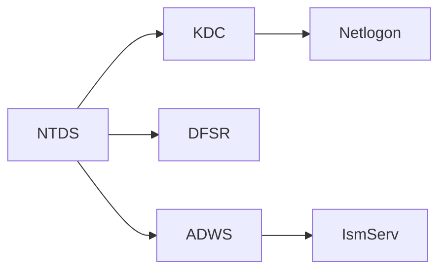

# 🧩 Windows Services & Active Directory – Technical Documentation

## Overview

This repository provides an in-depth technical overview and PowerShell implementation of **Windows Services** and their interdependencies within **Active Directory Domain Services (AD DS)**.
All scripts and observations are executed in a controlled lab environment under Windows Server.

---

## 1️⃣ Windows Services Fundamentals

Windows Services are **background processes** that ensure system functionality and service availability without user interaction.

**Key Characteristics**

* Operate independently from user sessions
* Can start automatically or manually
* Essential for network stability and authentication continuity

**Examples**

| Service Name | Display Name     | Function             |
| ------------ | ---------------- | -------------------- |
| WinDefend    | Windows Defender | System protection    |
| W32Time      | Windows Time     | Time synchronization |
| Spooler      | Print Spooler    | Manages print queues |

---

## 2️⃣ Active Directory Core Services and Dependencies

Active Directory relies on multiple Windows Services to provide centralized authentication, replication, and directory management.

| Service      | Process                             | Description                                              |
| ------------ | ----------------------------------- | -------------------------------------------------------- |
| **NTDS**     | Active Directory Domain Services    | Core AD database and directory logic                     |
| **ADWS**     | Active Directory Web Services       | Enables remote management via PowerShell and RSAT tools  |
| **DFSR**     | Distributed File System Replication | Replicates SYSVOL and GPO data across domain controllers |
| **KDC**      | Kerberos Key Distribution Center    | Issues and validates Kerberos tickets                    |
| **Netlogon** | Netlogon Service                    | Authenticates users and registers DC in DNS              |
| **IsmServ**  | Intersite Messaging Service         | Ensures replication between AD sites                     |

---

## 3️⃣ Functional Architecture



**Interaction Summary**

* `NTDS` acts as the AD core — all services depend on it
* `KDC` handles Kerberos authentication
* `Netlogon` is essential for domain logon and discovery
* `DFSR` maintains SYSVOL consistency across DCs
* `ADWS` enables modern remote administration
* `IsmServ` supports intersite replication

---

## 4️⃣ PowerShell Operations

### 4.1 Enumerate AD-related Services

```powershell
Get-Service | Where-Object {
    $_.DisplayName -like "*Directory*" -or $_.Name -match "NTDS|ADWS|DFSR|kdc|Netlogon|IsmServ"
} | Sort-Object DisplayName
```

### 4.2 Check Service Status

```powershell
Get-Service -Name NTDS, ADWS, DFSR
```

### 4.3 Manage Service Lifecycle

```powershell
Start-Service -Name Netlogon
Stop-Service -Name DFSR
Restart-Service -Name NTDS
```

### 4.4 Event Log Analysis

```powershell
Get-EventLog -LogName "Directory Service" -Newest 20
Get-EventLog -LogName "System" -Newest 20 | Where-Object {$_.Source -eq "Netlogon"}
Get-WinEvent -LogName "Directory Service" -MaxEvents 20 | Format-Table TimeCreated, Id, LevelDisplayName, Message -AutoSize
```

### 4.5 Export Logs

```powershell
Get-WinEvent -LogName "Directory Service" -MaxEvents 50 | Export-Csv -Path "C:\Logs\ADLogs.csv" -NoTypeInformation
```

---

## 5️⃣ Automation Scripts

### services1.ps1

```powershell
Get-Service | Where-Object {
    $_.DisplayName -like "*Directory*" -or $_.Name -match "NTDS|ADWS|DFSR|kdc|Netlogon|IsmServ"
} | Sort-Object DisplayName
Get-Service -Name NTDS, ADWS, DFSR
```

### services2.ps1

```powershell
Get-EventLog -LogName "Directory Service" -Newest 20
Get-EventLog -LogName "System" -Newest 20 | Where-Object {$_.Source -eq "Netlogon"}
Get-WinEvent -LogName "Directory Service" -MaxEvents 20 | Format-Table TimeCreated, Id, LevelDisplayName, Message -AutoSize
```

### services3.ps1

```powershell
Get-WinEvent -LogName "Directory Service" -MaxEvents 50 | Export-Csv -Path "C:\Logs\ADLogs.csv" -NoTypeInformation
```

### services4.ps1

```powershell
Stop-Service -Name DFSR
(Get-Service -Name DFSR).Status
Start-Service -Name DFSR
```

---

## 6️⃣ Dependency Matrix

| Service  | Critical Dependency | Impact if Stopped                         |
| -------- | ------------------- | ----------------------------------------- |
| NTDS     | Core                | Domain unavailable, GPOs inaccessible     |
| KDC      | NTDS                | Authentication failure (Kerberos tickets) |
| Netlogon | KDC                 | Logon and DNS registration fail           |
| DFSR     | NTDS                | SYSVOL replication halted                 |
| ADWS     | NTDS                | Remote AD management blocked              |
| IsmServ  | DFSR                | Intersite replication suspended           |

---

## 7️⃣ Administrative Best Practices

* Verify dependencies before stopping critical services
* Use `Restart-Service` instead of manual stop/start cycles
* Regularly monitor the **Directory Service** log for warnings and replication issues
* Export event logs periodically for audit and compliance
* Ensure time synchronization across DCs for Kerberos consistency

---

## 8️⃣ Lab Objectives

* Enumerate and analyze AD-related Windows services
* Investigate Active Directory event logs
* Export diagnostic logs for reporting
* Manage service states programmatically via PowerShell

---

## 9️⃣ Environment

**Operating System:** Windows Server 2022
**Tools Used:** PowerShell 7, Event Viewer, RSAT Tools
**Test Environment:** Active Directory Domain Controller (Lab setup)

---

## 🔧 Git Commands for Version Control

```powershell
git init
git add .
git commit -m "Initial commit - Windows & AD Services Lab"
git branch -M main
git remote add origin https://github.com/CollegeBoreal/INF1084-202-25A-03.git
git push -u origin main
```

---

## 👨‍💻 Author

**Author:** Zakaria Djellouli
**ID Étudiant :** 300150433


---

## ✅ Conclusion

Cette documentation consolide les connaissances théoriques et pratiques sur **Windows Services et Active Directory**.
Tous les scripts PowerShell démontrent le contrôle opérationnel, la compréhension des dépendances et les bonnes pratiques d’administration sur un serveur Windows.

---
