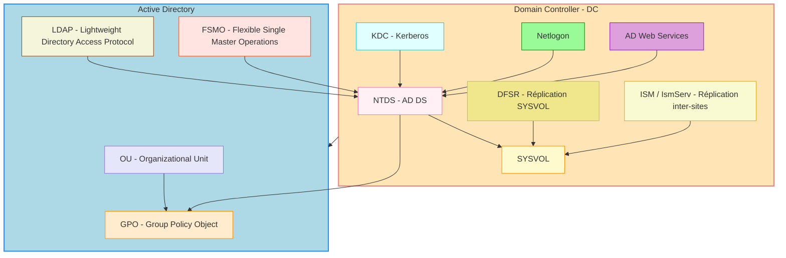

 🖥️ Leçon : Les services Windows et AD DS

## :zero: Introduction aux services Windows

Un **service Windows** est un programme qui s’exécute en arrière-plan pour fournir des fonctionnalités spécifiques au système ou aux applications.

* Ils **ne nécessitent pas d’interface graphique**.
* Ils peuvent **démarrer automatiquement au démarrage** ou **manuellement**.
* Les services assurent la **stabilité et la continuité** des fonctions essentielles de Windows.

**Exemples de services Windows :**

* `WinDefend` : Windows Defender
* `W32Time` : Service de temps Windows
* `Spooler` : Gestion de l’impression

---

## 1️⃣ Les Relations dans AD

Les principales abréviations et services d’Active Directory et leurs relations:

---

### 💡 Explications du schéma

* **DC** contient tous les services critiques : NTDS, KDC, Netlogon, DFSR, ADWS, ISM.
* **NTDS** est le cœur d’AD DS, lié à SYSVOL et aux GPO.
* **DFS et ISM** assurent la réplication des dossiers et des politiques.
* **OU, GPO, LDAP, FSMO** représentent les concepts et objets AD utilisés par les services.
* Les flèches indiquent les dépendances et interactions entre services et concepts.

## 2️⃣ Les services liés à Active Directory

Active Directory (AD) est une **infrastructure de gestion centralisée** des utilisateurs, ordinateurs et ressources réseau.
Les services AD dépendent de plusieurs **services Windows critiques**.

### 2.1 Liste des services AD importants

| Service                                 | Nom du service | Rôle / Description                                                                              |
| --------------------------------------- | -------------- | ----------------------------------------------------------------------------------------------- |
| **Active Directory Domain Services**    | `NTDS`         | Base de données AD, gestion des objets (utilisateurs, groupes, ordinateurs) et GPO.             |
| **Active Directory Web Services**       | `ADWS`         | Permet aux outils de gestion AD (PowerShell, ADUC) de se connecter à distance via web services. |
| **Distributed File System Replication** | `DFSR`         | Réplique les dossiers SYSVOL entre DC pour la cohérence des scripts et GPO.                     |
| **Kerberos Key Distribution Center**    | `kdc`          | Fournit les tickets Kerberos pour l’authentification des utilisateurs et ordinateurs.           |
| **Netlogon**                            | `Netlogon`     | Authentification des utilisateurs, localisation des DC et enregistrement des services dans AD.  |
| **Intersite Messaging Service**         | `IsmServ`      | Assure la réplication des données AD entre différents sites.  
