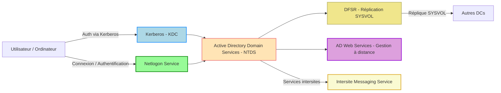
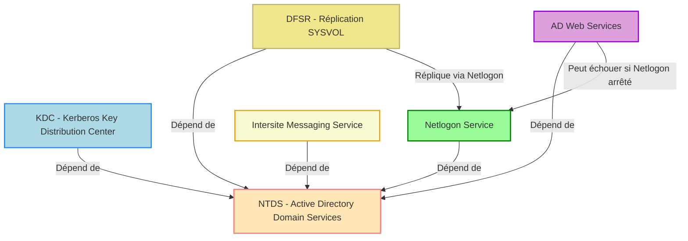

# 🖥️ Leçon : Les services Windows et AD DS

## 1️⃣ Introduction aux services Windows

Un **service Windows** est un programme qui s’exécute en arrière-plan pour fournir des fonctionnalités spécifiques au système ou aux applications.

* Ils **ne nécessitent pas d’interface graphique**.
* Ils peuvent **démarrer automatiquement au démarrage** ou **manuellement**.
* Les services assurent la **stabilité et la continuité** des fonctions essentielles de Windows.

**Exemples de services Windows :**

* `WinDefend` : Windows Defender
* `W32Time` : Service de temps Windows
* `Spooler` : Gestion de l’impression

---

## 2️⃣ Les services liés à Active Directory

Active Directory (AD) est une **infrastructure de gestion centralisée** des utilisateurs, ordinateurs et ressources réseau.
Les services AD dépendent de plusieurs **services Windows critiques**.

### 2.1 Liste des services AD importants

| Service                                 | Nom du service | Rôle / Description                                                                              |
| --------------------------------------- | -------------- | ----------------------------------------------------------------------------------------------- |
| **Active Directory Domain Services**    | `NTDS`         | Base de données AD, gestion des objets (utilisateurs, groupes, ordinateurs) et GPO.             |
| **Active Directory Web Services**       | `ADWS`         | Permet aux outils de gestion AD (PowerShell, ADUC) de se connecter à distance via web services. |
| **Distributed File System Replication** | `DFSR`         | Réplique les dossiers SYSVOL entre DC pour la cohérence des scripts et GPO.                     |
| **Kerberos Key Distribution Center**    | `kdc`          | Fournit les tickets Kerberos pour l’authentification des utilisateurs et ordinateurs.           |
| **Netlogon**                            | `Netlogon`     | Authentification des utilisateurs, localisation des DC et enregistrement des services dans AD.  |
| **Intersite Messaging Service**         | `IsmServ`      | Assure la réplication des données AD entre différents sites.                                    |

---

### 2.2 Commandes PowerShell utiles pour explorer les services AD

```powershell
# Lister tous les services liés à AD
Get-Service | Where-Object {
    $_.DisplayName -like "*Directory*" -or $_.Name -match "NTDS|ADWS|DFSR|kdc|Netlogon|IsmServ"
} | Sort-Object DisplayName

# Vérifier l’état d’un service spécifique
Get-Service -Name NTDS, ADWS, DFSR
```

💡 **Astuce pédagogique :** Demander aux étudiants d’exécuter ces commandes sur un DC pour identifier les services essentiels.

---

## 3️⃣ Comment fonctionnent les services AD ensemble

Voici un schéma Mermaid simplifié pour visualiser les interactions :



**Explications :**

* **NTDS** est le cœur, toutes les autres fonctions gravitent autour.
* **KDC** gère l’authentification Kerberos.
* **Netlogon** est indispensable pour l’accès réseau et la découverte des DC.
* **DFSR** garantit que tous les DC ont les mêmes scripts et GPO.
* **ADWS** permet la gestion distante de l’AD.
* **IsmServ** synchronise les données entre sites différents.

---

## 4️⃣ Points clés à retenir

1. Les services Windows sont essentiels pour la stabilité et les fonctions réseau.
2. Les **services AD DS** sont interconnectés et critiques pour :

   * Authentification (KDC, Netlogon)
   * Gestion des objets et GPO (NTDS)
   * Réplication intersites (DFSR, IsmServ)
   * Administration distante (ADWS)
3. Un problème sur un service AD critique peut **paralyser l’authentification** et la **gestion des ressources** dans le domaine.

## Dépendances

Dépendances critiques entre les services Active Directory et l’impact possible de l’arrêt d’un service :



---

### 💡 Explications

* **NTDS** est le cœur : si arrêté, tous les autres services AD sont impactés.
* **KDC** : arrêt → impossible de générer des tickets Kerberos.
* **Netlogon** : arrêt → clients ne peuvent plus s’authentifier ; services dépendants peuvent fonctionner mais seront limités.
* **DFSR** : arrêt → bloque la réplication SYSVOL.
* **ADWS** : arrêt → empêche la gestion à distance.
* **IsmServ** : arrêt → réplication inter-sites bloquée.


