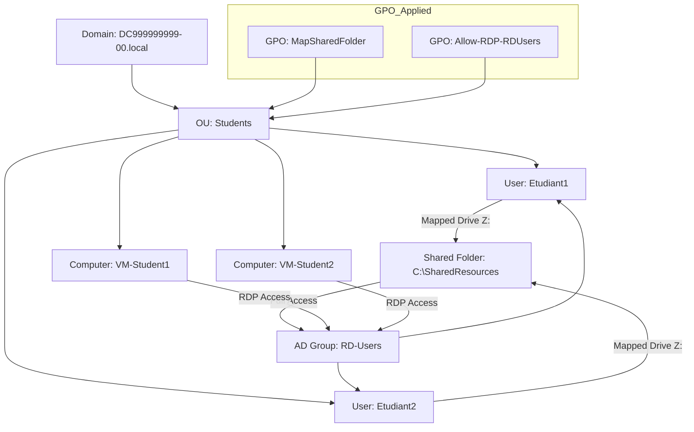

# GPO
---

## Qu’est-ce qu’un **GPO** ?

**GPO** = **Group Policy Object**
En français : **Objet de stratégie de groupe**.

C’est un **ensemble de règles et configurations** que l’on peut appliquer à des ordinateurs ou des utilisateurs dans un **domaine Active Directory**.

En gros, c’est le **moyen de gérer centralement la configuration de toutes les machines et comptes d’un domaine**.

---

### 1️⃣ À quoi sert un GPO ?

* **Configurer le système** : par exemple, définir le fond d’écran, la page d’accueil du navigateur, ou désactiver certains boutons du panneau de configuration.
* **Sécuriser le domaine** : forcer des mots de passe forts, interdire l’accès à certains comptes, configurer l’antivirus, etc.
* **Automatiser des actions** :

  * Créer des lecteurs réseau automatiquement pour les utilisateurs
  * Déployer des scripts de connexion/déconnexion
  * Installer des logiciels sur toutes les machines
* **Contrôler l’accès aux ressources** : partager des fichiers ou autoriser l’accès à distance (RDP) pour certains groupes.

---

### 2️⃣ Comment ça fonctionne ?

1. On crée un **GPO** dans **Active Directory**.
2. On **associe ce GPO à une OU (Organizational Unit)**, un domaine ou un site.
3. Tous les **utilisateurs ou ordinateurs de l’OU** appliquent automatiquement les règles du GPO.

> Exemple : tu crées un GPO qui mappe automatiquement un lecteur réseau `Z:` pour tous les étudiants dans l’OU `Students`.
> Chaque étudiant verra le lecteur `Z:` sans rien faire.

---

### 3️⃣ Types de paramètres dans un GPO

* **User Configuration** → paramètres appliqués aux **utilisateurs**
* **Computer Configuration** → paramètres appliqués aux **ordinateurs**

Chacun peut contenir :

* **Policies (stratégies)** : paramètres bloquants ou obligatoires
* **Preferences (préférences)** : paramètres « souples » que l’utilisateur peut modifier

---

### 4️⃣ Exemple concret

* Objectif : tous les étudiants ont un **lecteur réseau Z:** mappé automatiquement vers un dossier partagé.
* On crée un GPO :

  * **User Configuration → Preferences → Drive Maps → Z:**
  * On le lie à l’OU `Students`
* Résultat : tous les comptes dans l’OU `Students` ont le lecteur `Z:` sans intervention manuelle.

---



---

1. Créer un **dossier partagé**
2. Créer des **groupes et utilisateurs AD**
3. Map le **lecteur réseau via GPO (preferences)**
4. Activer **RDP pour un groupe d’utilisateurs**
5. Appliquer les **GPO sur une OU spécifique**

---

# Leçon pratique : Partage de ressources et RDP via PowerShell

## 1️⃣ Pré-requis

* DC Windows Server 2022 avec AD DS installé
* Module Active Directory disponible (`Import-Module ActiveDirectory`)
* Module GroupPolicy disponible (`Import-Module GroupPolicy`)
* VM membre pour tester le partage et RDP

---

## 2️⃣ Créer le dossier partagé

```powershell
# Chemin du dossier
$SharedFolder = "C:\SharedResources"

# Créer le dossier
New-Item -Path $SharedFolder -ItemType Directory -Force

# Créer un partage SMB pour le groupe RD-Users
$GroupName = "RD-Users"

# Créer le groupe AD
New-ADGroup -Name $GroupName -GroupScope Global -Description "Users allowed RDP and shared folder access"

# Créer des utilisateurs AD et les ajouter au groupe
$Users = @("Etudiant1","Etudiant2")
foreach ($user in $Users) {
    New-ADUser -Name $user -SamAccountName $user -AccountPassword (ConvertTo-SecureString "Pass123!" -AsPlainText -Force) -Enabled $true
    Add-ADGroupMember -Identity $GroupName -Members $user
}

# Partager le dossier avec le groupe
New-SmbShare -Name "SharedResources" -Path $SharedFolder -FullAccess $GroupName
```

---

## 3️⃣ Créer une GPO pour mapper le lecteur réseau

```powershell
# Nom de la GPO
$GPOName = "MapSharedFolder"

# Créer la GPO
New-GPO -Name $GPOName

# Lier la GPO à une OU spécifique (ex: "StudentsOU")
$OU = "OU=StudentsOU,DC=DC999999999-00,DC=local"
New-GPLink -Name $GPOName -Target $OU

# Créer une preference pour mapper le lecteur réseau
$DriveLetter = "Z:"
$SharePath = "\\DC999999999-00\SharedResources"

# Créer l’action de mapping via XML (GPP Drive Maps)
$XML = @"
<DriveMap clsid="{4FD5B7DD-5FCE-4F73-9211-169C4D47F5D5}" action="U" label="$DriveLetter" letter="$DriveLetter" path="$SharePath" />
"@

# Importer via PowerShell GPP (nécessite module GroupPolicy et GPP XML)
Import-GPO -BackupGpoName $GPOName -Path $XML
```

> ⚠ Remarque : La création complète d’un GPP via PowerShell est un peu complexe, car `New-GPPreference` n’existe pas en natif. On peut contourner via **`Set-GPRegistryValue`** pour mapper le lecteur avec un script logon :

```powershell
$Script = "net use Z: \\DC999999999-00\SharedResources"
Set-GPStartupScript -Name $GPOName -ScriptName "MapDrive.bat" -ScriptParameters $Script
```

---

## 4️⃣ Activer RDP pour le groupe

```powershell
# Autoriser RDP sur la machine
Set-ItemProperty -Path "HKLM:\System\CurrentControlSet\Control\Terminal Server" -Name "fDenyTSConnections" -Value 0

# Autoriser le firewall RDP
Enable-NetFirewallRule -DisplayGroup "Remote Desktop"

# Donner le droit logon via RDP au groupe RD-Users
secedit /export /cfg C:\secpol.cfg
# Modifier le fichier pour inclure RD-Users dans "SeRemoteInteractiveLogonRight"
# Puis réimporter
secedit /import /cfg C:\secpol.cfg /db C:\secpol.sdb /overwrite
```

> Astuce : on peut aussi utiliser `ntrights.exe` du Resource Kit pour assigner RDP à un groupe via PowerShell.

---

## 5️⃣ Test

1. Connecte-toi avec un des utilisateurs du groupe `RD-Users`
2. Vérifie que :

   * Le lecteur réseau `Z:` est mappé automatiquement
   * L’utilisateur peut se connecter en **RDP**
3. Essaye un utilisateur hors du groupe → il ne doit **pas** avoir accès.

---

💡 **Avantages pédagogiques** :

* Les étudiants manipulent **AD, GPO, RDP, SMB** uniquement via **PowerShell**
* Aucun besoin d’interface graphique
* Tout peut être reproduit sur Hyper-V pour plusieurs VMs

---

Si tu veux, je peux te créer **un script PowerShell complet prêt à exécuter** pour la leçon, qui fait **tout d’un coup** :

* Création du dossier
* Création du groupe et des utilisateurs
* Partage du dossier
* Mapping du lecteur réseau via script GPO
* Activation RDP pour le groupe

Veux‑tu que je fasse ce script ?

