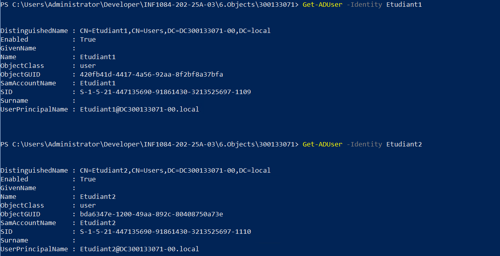
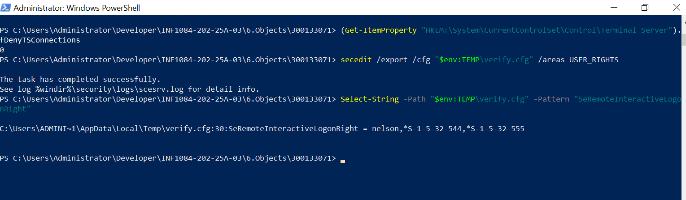

# Pour s'assurer que nos scripts fonctionnement nous pouvons exercuter ces scripts de verification

## 1️⃣ Vérifier le partage SMB (Shared Folder)

```powershell
Get-SmbShare | Where-Object { $_.Name -eq "SharedResources" }
```
```powershell
Name            ScopeName Path               Description
----            --------- ----               -----------
SharedResources *         C:\SharedResources
```

## 2️⃣ Vérifier que le dossier existe

```powershell
Test-Path "C:\SharedResources"
```
```powershell
True
```

## 3️⃣ Vérifier le groupe AD Students
```powershell
Get-ADGroup -Identity "Students"
```
```powershell
DistinguishedName : CN=Students,CN=Users,DC=DC300133071-00,DC=local
GroupCategory     : Security
GroupScope        : Global
Name              : Students
ObjectClass       : group
ObjectGUID        : b635f958-e433-41ab-99fd-b36bbd80fad5
SamAccountName    : Students
SID               : S-1-5-21-447135690-91861430-3213525697-1108
```
## 4️⃣ Vérifier que les utilisateurs existent
```powershell
Get-ADUser -Identity Etudiant1
Get-ADUser -Identity Etudiant2
```


## 5️⃣ Vérifier la GPO de mapping réseau
```powershell
Get-GPO -Name "MapSharedFolder"
```
```powershell
DisplayName      : MapSharedFolder
DomainName       : DC300133071-00.local
Owner            : DC300133071-00\Domain Admins
Id               : 9d5ab9bb-f8ef-4d62-b89b-dec233b18c7d
GpoStatus        : AllSettingsEnabled
Description      :
CreationTime     : 11/18/2025 10:38:11 PM
ModificationTime : 11/18/2025 10:51:28 PM
UserVersion      : AD Version: 5, SysVol Version: 5
ComputerVersion  : AD Version: 0, SysVol Version: 0
WmiFilter        :
```

## 6️⃣ Vérifier l’activation RDP et Vérifier que le groupe Students a le droit RDP
```powershell
(Get-ItemProperty "HKLM:\System\CurrentControlSet\Control\Terminal Server").fDenyTSConnections
```
```powershell
secedit /export /cfg "$env:TEMP\verify.cfg" /areas USER_RIGHTS
Select-String -Path "$env:TEMP\verify.cfg" -Pattern "SeRemoteInteractiveLogonRight"
```

