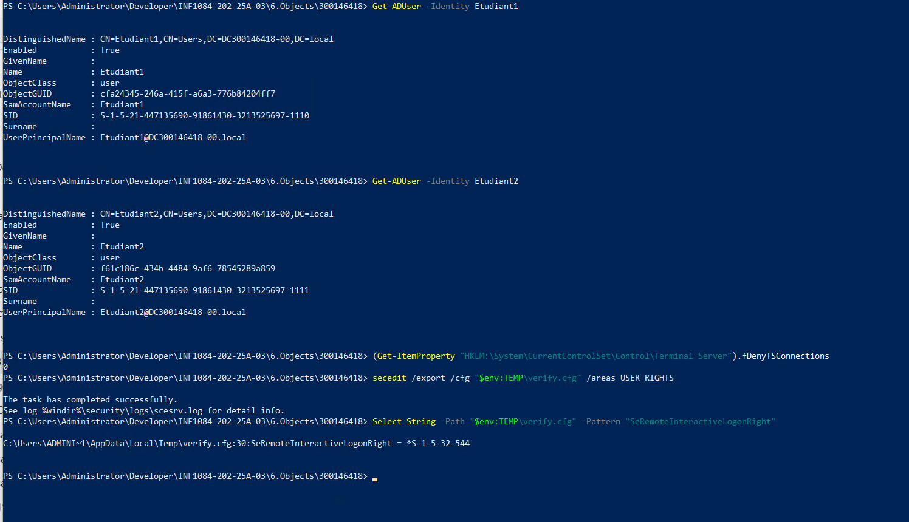

# **🧪 TP Active Directory – Partage réseau, GPO et RDP (via PowerShell)**

**Auteur : 300146418 — Ikram**

---

## ## 🎯 **Objectif du TP**

Ce laboratoire vise à configurer entièrement un environnement Active Directory **sans interface graphique**, uniquement via **PowerShell**.

Tu vas apprendre à :

* Créer un partage réseau
* Créer des utilisateurs et un groupe AD
* Lier une GPO à une OU
* Mapper automatiquement un lecteur réseau **Z:**
* Donner l’accès RDP à un groupe
* Tester les accès avec un utilisateur étudiant
* Utiliser le script bootstrap.ps1 pour définir ton domaine

---

# ## 🗂️ Structure utilisée

```
INF1084-202-25A-03/
 └── 6.Objects/
      └── 300146418/
           ├── utilisateurs1.ps1
           ├── utilisateurs2.ps1
           ├── utilisateurs3.ps1
           └── README.md
```

---

# ## 🏛️ 1. Préparation de l’environnement

Avant de lancer les scripts, j’ai exécuté :

```powershell
. "C:\Users\Administrator\Developer\INF1084-202-25A-03\4.OUs\300146418\bootstrap.ps1"
```

Ce fichier définit automatiquement :

* `$domainName` → ex : **DC300146418-00.local**
* `$netbiosName` → ex : **DC300146418-00**
* `$cred` → les identifiants administrateurs du domaine

Ces variables sont ensuite utilisées dans chaque script.

---

# ## 🧩 2. Rôle des fichiers PowerShell

## ### 📌 **1️⃣ utilisateurs1.ps1 — Création des objets AD**

Ce script :

✔️ crée un groupe Active Directory (ex : **Students**)
✔️ crée les utilisateurs du labo (Etudiant1, Etudiant2…)
✔️ active les comptes et leur assigne un mot de passe
✔️ ajoute les utilisateurs dans le groupe Students

➡️ **But : préparer les comptes qui vont utiliser le lecteur Z:**

---

## ### 📌 **2️⃣ utilisateurs2.ps1 — Création de la GPO + logon script**

Ce script :

✔️ crée une GPO appelée **MapSharedFolder**
✔️ attache la GPO à l’OU : `OU=Utilisateurs`
✔️ génère un script logon `.bat` qui mappe automatiquement :
`Z: → \\DC300146418-00\partage`
✔️ place le script dans `SYSVOL`

➡️ **But : que chaque étudiant voie automatiquement un lecteur réseau Z: lors de sa connexion.**

⚠️ Une petite étape manuelle reste nécessaire dans GPMC :
Ajouter le script MapDriveZ.bat dans :
**User Configuration → Windows Settings → Scripts (Logon)**

---

## ### 📌 **3️⃣ utilisateurs3.ps1 — Partage réseau + RDP**

Ce script :

✔️ crée un dossier partagé : `C:\Partage_Students`
✔️ donne les permissions NTFS au groupe Students
✔️ crée le partage SMB : `\\DC300146418-00\partage`
✔️ active Remote Desktop (RDP)
✔️ permet au groupe Students d’utiliser RDP

➡️ **But : autoriser les étudiants à accéder au dossier partagé + connexion RDP.**

---

# ## 🧪 3. Tests effectués

### ✔️ **1. Test de la création des utilisateurs**

`Get-ADUser -Filter *`

### ✔️ **2. Test de la GPO**

`Get-GPO -All`

### ✔️ **3. Test du partage SMB**

`\\DC300146418-00\partage`

### ✔️ **4. Test du lecteur Z**

Avec un compte étudiant :

* connexion sur une machine membre du domaine
* vérifier que **Z:** apparaît automatiquement
* créer un fichier dans Z:\ pour vérifier les permissions

### ✔️ **5. Test RDP**

Connexion avec un utilisateur du groupe Students
→ accès autorisé
Connexion avec un utilisateur hors du groupe
→ accès bloqué

---

# ## 📚 Conclusion

À travers ce TP, j’ai entièrement :

* créé des objets Active Directory
* configuré un partage réseau sécurisé
* déployé une GPO pour mapper automatiquement un lecteur réseau
* configuré et sécurisé l’accès RDP
* testé <u>toutes</u> les fonctionnalités avec un compte utilisateur

Le tout **sans interface graphique**, uniquement en PowerShell.

Ce TP démontre la capacité à :

💡 automatiser un domaine AD
💡 gérer des permissions NTFS et SMB
💡 configurer GPO + scripts logon
💡 administrer un environnement Windows Server comme en entreprise




