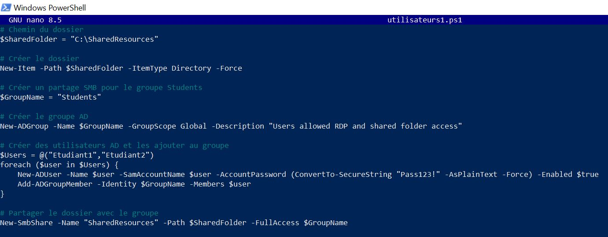
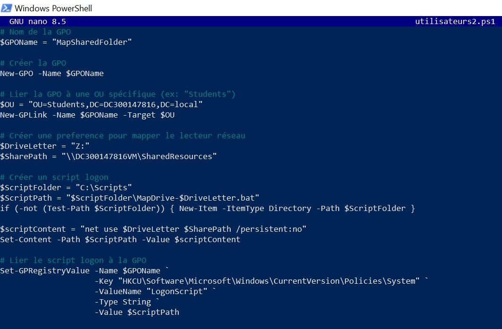
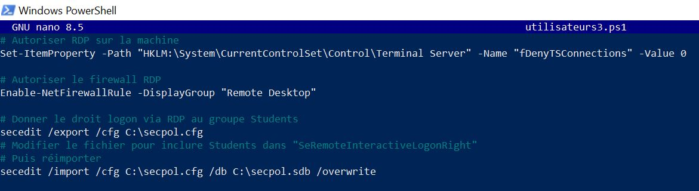

**Activité 6 : Gestion des Objets AD et Stratégies de Groupe (GPO)**

** Description**

Ce projet contient trois scripts PowerShell pour la gestion d'Active Directory et des Stratégies de Groupe (GPO) dans un environnement Windows Server. Les scripts automatisent la création d'utilisateurs, de groupes, de partages réseau et la configuration des droits d'accès à distance.

**Objectifs**

- Créer des utilisateurs et groupes Active Directory

- Configurer des partages réseau avec permissions

- Automatiser le mappage de lecteurs via GPO

- Donner l'accès RDP à des groupes spécifiques

 🎈 **Scripts PowerShell:**

1. **utilisateurs1.ps1 - Creation des ressources partagees:**
Objectif : Créer l'infrastructure de base pour les étudiants

**Fonctionnalités :**

- Crée le dossier partagé C:\SharedResources

- Crée le groupe AD Students

- Crée les utilisateurs Etudiant1 et Etudiant2

- Ajoute les utilisateurs au groupe Students

- Partage le dossier avec permissions pour le groupe

Voila le code de utilisateurs1.ps1:



On aura a lexecution:

```powershell

PS C:\Users\Administrator\Developer\INF1084-202-25A-03\6.Objects\300147816> .\utilisateurs1.ps1


    Directory: C:\


Mode                 LastWriteTime         Length Name
----                 -------------         ------ ----
d-----         12/4/2025   2:03 AM                SharedResources

AvailabilityType      : NonClustered
CachingMode           : Manual
CATimeout             : 0
CompressData          : False
ConcurrentUserLimit   : 0
ContinuouslyAvailable : False
CurrentUsers          : 0
Description           :
EncryptData           : False
FolderEnumerationMode : Unrestricted
IdentityRemoting      : False
Infrastructure        : False
LeasingMode           : Full
Name                  : SharedResources
Path                  : C:\SharedResources
Scoped                : False
ScopeName             : *
SecurityDescriptor    : O:SYG:SYD:(A;;FA;;;S-1-5-21-447135690-91861430-3213525697-1120)
ShadowCopy            : False
ShareState            : Online
ShareType             : FileSystemDirectory
SmbInstance           : Default
Special               : False
Temporary             : False
Volume                : \\?\Volume{d9f7716d-765c-4de2-bbd2-1c33f3e87e19}\
PSComputerName        :
PresetPathAcl         : System.Security.AccessControl.DirectorySecurity
```
On peut verifier que  le groupe AD Students est bien cree en executant la commande suivante:

```powershell

PS C:\Users\Administrator\Developer\INF1084-202-25A-03\6.Objects\300147816> Get-ADGroup -Identity "Students"


DistinguishedName : CN=Students,CN=Users,DC=DC300147816,DC=local
GroupCategory     : Security
GroupScope        : Global
Name              : Students
ObjectClass       : group
ObjectGUID        : 4ceafb37-3339-444b-9fd4-b71b2a095d58
SamAccountName    : Students
SID               : S-1-5-21-447135690-91861430-3213525697-1120
```
On peut verifier que les utilisateurs Etudiant1 et Etudiant2 sont bien crees en executant la commande suivante:

```powershell 
PS C:\Users\Administrator\Developer\INF1084-202-25A-03\6.Objects\300147816> Get-ADUser -Identity "Etudiant1"


DistinguishedName : CN=Etudiant1,CN=Users,DC=DC300147816,DC=local
Enabled           : True
GivenName         :
Name              : Etudiant1
ObjectClass       : user
ObjectGUID        : 44bbbd33-6678-44c6-9678-347abf68e26f
SamAccountName    : Etudiant1
SID               : S-1-5-21-447135690-91861430-3213525697-1121
Surname           :
UserPrincipalName :


PS C:\Users\Administrator\Developer\INF1084-202-25A-03\6.Objects\300147816> Get-ADUser -Identity "Etudiant2"


DistinguishedName : CN=Etudiant2,CN=Users,DC=DC300147816,DC=local
Enabled           : True
GivenName         :
Name              : Etudiant2
ObjectClass       : user
ObjectGUID        : a8e3e733-b62e-4534-8ef8-a260db5b49e5
SamAccountName    : Etudiant2
SID               : S-1-5-21-447135690-91861430-3213525697-1122
Surname           :
UserPrincipalName :
```
On peut Vérifier que les utilisateurs sont dans le groupe Students en executant la commande suivante:

```powershell

PS C:\Users\Administrator\Developer\INF1084-202-25A-03\6.Objects\300147816> Get-ADGroupMember -Identity "Students" | Format-Table Name, SamAccountName, ObjectClass

Name      SamAccountName ObjectClass
----      -------------- -----------
Etudiant1 Etudiant1      user
Etudiant2 Etudiant2      user
```
On peut verifier que le dossier est partagé avec permissions pour le groupe en executant la commande suivante:

```powershell

PS C:\Users\Administrator\Developer\INF1084-202-25A-03\6.Objects\300147816> # Commande 1 : Vérifier que le partage existe
PS C:\Users\Administrator\Developer\INF1084-202-25A-03\6.Objects\300147816> Get-SmbShare -Name "SharedResources"

Name            ScopeName Path               Description
----            --------- ----               -----------
SharedResources *         C:\SharedResources


PS C:\Users\Administrator\Developer\INF1084-202-25A-03\6.Objects\300147816>
PS C:\Users\Administrator\Developer\INF1084-202-25A-03\6.Objects\300147816> # Commande 2 : Vérifier les permissions
PS C:\Users\Administrator\Developer\INF1084-202-25A-03\6.Objects\300147816> Get-SmbShareAccess -Name "SharedResources"

Name            ScopeName AccountName            AccessControlType AccessRight
----            --------- -----------            ----------------- -----------
SharedResources *         DC300147816VM\Students Allow             Full
```
2. **utilisateurs2.ps1 - Configuration GPO de mappage**

Objectif : Automatiser le mappage du lecteur réseau Z: pour les étudiants

**Fonctionnalités :**

- Crée la GPO MapSharedFolder

- Lie la GPO à l'OU Students

- Génère un script logon batch

- Configure l'exécution automatique à l'ouverture de session

Voia le code de utilisateurs2.ps1:



On peut faire la verification GPO:
```powershell
PS C:\Users\Administrator\Developer\INF1084-202-25A-03\6.Objects\300147816> Get-GPO -Name "MapSharedFolder"


DisplayName      : MapSharedFolder
DomainName       : DC300147816.local
Owner            : DC300147816VM\Domain Admins
Id               : 7bc7c19c-9364-4443-a05c-71d5ca837b32
GpoStatus        : AllSettingsEnabled
Description      :
CreationTime     : 12/4/2025 2:03:42 AM
ModificationTime : 12/4/2025 3:05:22 AM
UserVersion      : AD Version: 3, SysVol Version: 3
ComputerVersion  : AD Version: 0, SysVol Version: 0
WmiFilter        :
```
3. **utilisateurs3.ps1 - Attribution des droits RDP**

Objectif : Donner l'accès Bureau à distance au groupe Students

**Fonctionnalités :**

- Active le service RDP sur le serveur

- Ouvre les règles firewall nécessaires

- Exporte/modifie la politique de sécurité

- Ajoute le groupe Students aux droits SeRemoteInteractiveLogonRight

- Applique les changements immédiatement

Voila le code de utilisateurs3.ps1:



On peut Vérifier 'activation RDP et que le groupe Students a le droit RDP en executant ces commandes :

```powershell

PS C:\Users\Administrator\Developer\INF1084-202-25A-03\6.Objects\300147816> (Get-ItemProperty "HKLM:\System\CurrentControlSet\Control\Terminal Server").fDenyTSConnections
0
```
```powershell
PS C:\Users\Administrator\Developer\INF1084-202-25A-03\6.Objects\300147816> secedit /export /cfg "$env:TEMP\verify.cfg" /areas USER_RIGHTS

The task has completed successfully.
See log %windir%\security\logs\scesrv.log for detail info.
PS C:\Users\Administrator\Developer\INF1084-202-25A-03\6.Objects\300147816> Select-String -Path "$env:TEMP\verify.cfg" -Pattern "SeRemoteInteractiveLogonRight"

C:\Users\ADMINI~1\AppData\Local\Temp\verify.cfg:33:SeRemoteInteractiveLogonRight = Students,*S-1-5-32-544
```
