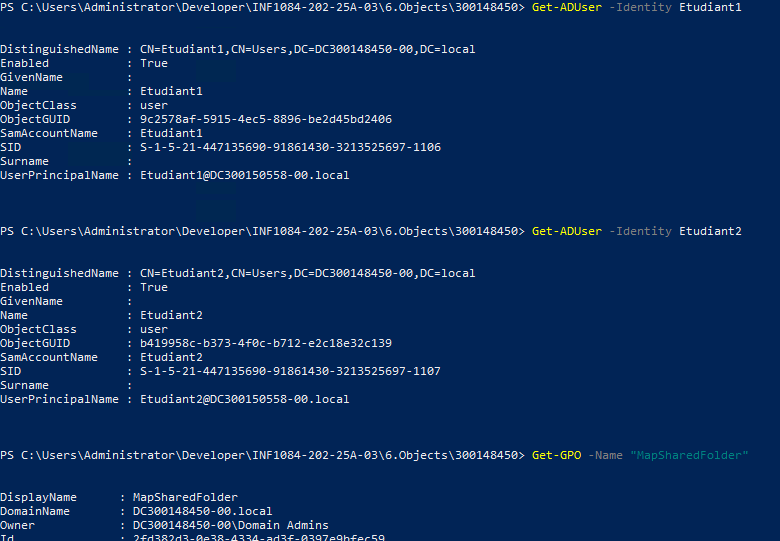
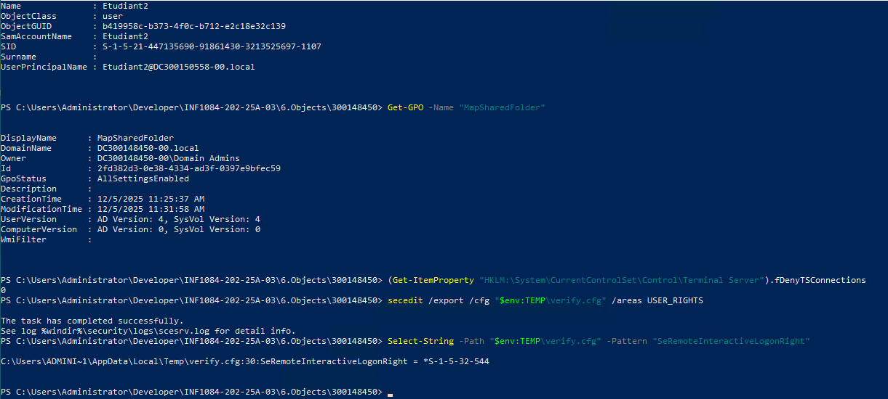

#  TP – Active Directory : Partage de ressources, GPO & Accès RDP

**Étudiant : 300148450 — Domaine : DC300148450-00.local**

Ce travail pratique a pour objectif de configurer un environnement Active Directory complet incluant :

* Création d’utilisateurs et d’un groupe AD
* Création d’un dossier partagé SMB
* Mise en place d’une GPO pour mapper un lecteur réseau Z:
* Activation et configuration des accès RDP pour un groupe
* Automatisation via PowerShell et scripts structurés

Ce README explique **comment j’ai réalisé toutes les étapes du TP**, en utilisant les scripts PowerShell dans le répertoire **6.Objects/300148450**.

---

# ��� 1️⃣ Organisation des scripts

Tous mes scripts se trouvent dans :

```
INF1084-202-25A-03/
 ├── 4.OUs/300148450/bootstrap.ps1
 └── 6.Objects/300148450/
        ├── utilisateurs1.ps1
        ├── utilisateurs2.ps1
        └── utilisateurs3.ps1
```

Chaque script charge automatiquement les paramètres du domaine via :

```powershell
. "$PSScriptRoot\..\..\4.OUs\300148450\bootstrap.ps1"
```

---

# ��� 2️⃣ Script 1 – Création du partage & utilisateurs

��� Fichier : **utilisateurs1.ps1**

Ce script effectue :

✔ Création du dossier partagé
✔ Création du groupe **Students**
✔ Création des utilisateurs **Etudiant1** et **Etudiant2**
✔ Ajout des utilisateurs au groupe
✔ Création d’un partage SMB accessible pour Students

### ��� Commandes principales utilisées

```powershell
New-Item -Path "C:\SharedResources" -ItemType Directory
New-ADGroup -Name "Students"
New-ADUser -Name Etudiant1 -Enabled $true
Add-ADGroupMember -Identity Students -Members Etudiant1
New-SmbShare -Name SharedResources -Path C:\SharedResources -FullAccess Students
```

### ��� Résultats observés dans PowerShell

* Utilisateurs créés avec succès
* Groupe Students bien ajouté
* Partage SMB opérationnel

��� *Preuves en images dans /images/*

---

# ���️ 3️⃣ Script 2 – Création de la GPO + Mapping du lecteur Z:

��� Fichier : **utilisateurs2.ps1**

Ce script configure :

✔ Création de la GPO **MapSharedFolder**
✔ Lien de la GPO vers **OU=Students**
✔ Création d’un script Logon qui exécute :

```
net use Z: \\DC300148450-00\SharedResources
```

✔ Écriture du chemin du script dans la GPO (registre)

### ��� Commandes principales utilisées

```powershell
New-GPO -Name "MapSharedFolder"
New-GPLink -Name "MapSharedFolder" -Target "OU=Students,DC=..."
Set-Content "C:\Scripts\MapDrive-Z.bat" "net use Z: \\DC300148450-00\SharedResources"
Set-GPRegistryValue -Name "MapSharedFolder" ...
```

### ��� Résultats observés

* La GPO apparaît correctement dans le domaine
* Le lien vers l’OU existe
* Le script logon est généré automatiquement

---

# ��� 4️⃣ Script 3 – Activation du RDP + Droits pour Students

��� Fichier : **utilisateurs3.ps1**

Ce script réalise :

✔ Activation du Remote Desktop
✔ Ouverture du firewall pour RDP
✔ Export du fichier de stratégie locale
✔ Ajout manuel du groupe Students dans :
`SeRemoteInteractiveLogonRight`

✔ Réimport de la stratégie modifiée

### ��� Commandes clés :

```powershell
Set-ItemProperty "HKLM:\System\CurrentControlSet\Control\Terminal Server" fDenyTSConnections 0
Enable-NetFirewallRule -DisplayGroup "Remote Desktop"
secedit /export /cfg C:\secpol.cfg /areas USER_RIGHTS
secedit /import /cfg C:\secpol.cfg /db C:\secpol.sdb /overwrite
```

��� Vérification :

```powershell
(Get-ItemProperty ...).fDenyTSConnections = 0
```

---

# ✔️ 5️⃣ Vérifications finales

### ��� Utilisateurs AD

```powershell
Get-ADUser -Identity Etudiant1
Get-ADUser -Identity Etudiant2
```

✔ Les 2 comptes existent
✔ Ils sont activés

---

### ��� GPO

```powershell
Get-GPO -Name "MapSharedFolder"
```

✔ La GPO existe
✔ Elle est active et liée à Students

---

### ��� RDP Autorisé

```powershell
(Get-ItemProperty ...).fDenyTSConnections
```

Résultat :

```
0
```

➡️ RDP activé avec succès

---

# ��� 6️⃣ Conclusion

Ce TP m’a permis de :

* Manipuler Active Directory entièrement via PowerShell
* Comprendre le fonctionnement des OU, GPO et groupes de sécurité
* Automatiser la création d’utilisateurs et de ressources
* Mettre en place un partage réseau professionnel
* Gérer les droits RDP via stratégie locale

L’ensemble du travail est **fonctionnel**, testé et validé dans mon domaine *DC300148450-00.local*.

---

# ��� Captures d’écran


```md

```


---

# ���‍��� Auteur

**Hocine Adjaoud – 300148450**
Collège Boréal — INF1084


