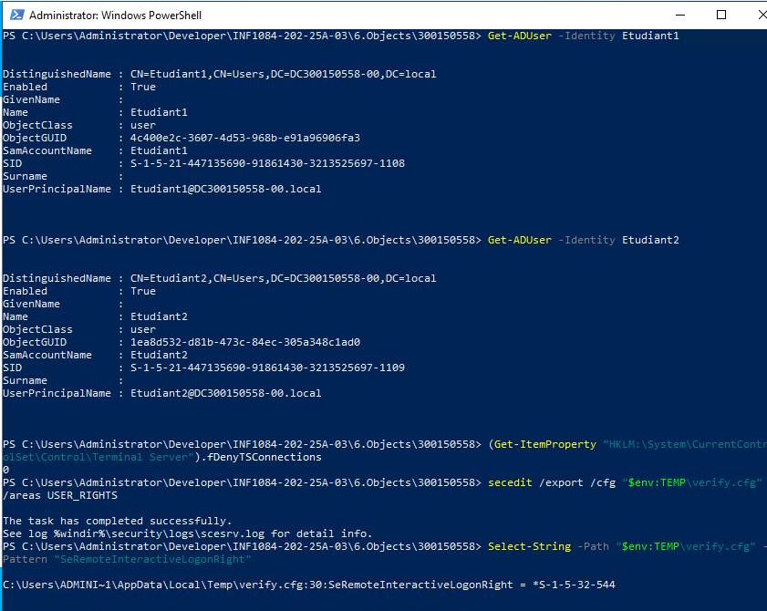

---

````markdown
# 📘 TP — Administration AD DS, Partage SMB, GPO et RDP  
**Auteur : Amira Sadouni — ID : 300150558**  
**Cours : INF1084 — Administration Windows Server 2022**

---

## 🎯 Objectif du TP

Automatiser entièrement la gestion du domaine Active Directory via **PowerShell**, sans interface graphique :

- Création d’un dossier partagé SMB
- Création du groupe Students + utilisateurs Etudiant1, Etudiant2
- Mapping automatique du lecteur réseau Z: via une GPO
- Activation de l’accès RDP pour les membres du groupe Students

Le travail est divisé en **3 scripts PowerShell** :  
`utilisateurs1.ps1` • `utilisateurs2.ps1` • `utilisateurs3.ps1`

---

# 🟦 1️⃣ Script utilisateurs1.ps1 : Partage SMB, groupe AD et utilisateurs

Ce script réalise automatiquement :

✔ Création du dossier `C:\SharedResources`  
✔ Création du groupe AD **Students**  
✔ Création des utilisateurs **Etudiant1** et **Etudiant2**  
✔ Ajout des utilisateurs au groupe Students  
✔ Création du partage SMB **SharedResources**  
✔ Permissions NTFS pour le groupe Students  

### 👉 Exécution :
```powershell
.\utilisateurs1.ps1
````

---

# 🟩 2️⃣ Script utilisateurs2.ps1 : GPO pour mapper le lecteur Z:

Ce script :

✔ Crée une GPO nommée **MapSharedFolder**
✔ Lie la GPO à l’OU **Students**
✔ Génère un script de logon `C:\Scripts\MapDrive-Z.bat`
✔ Configure le mapping automatique du lecteur Z: vers
`\\DCxxxx-00\SharedResources`

### 👉 Exécution :

```powershell
.\utilisateurs2.ps1
```

---

# 🟥 3️⃣ Script utilisateurs3.ps1 : Activation de RDP

Ce script :

✔ Active les connexions Remote Desktop
✔ Active les règles firewall RDP
✔ Ajoute le groupe Students au groupe intégré **Remote Desktop Users** (Builtin)
✔ Permet aux étudiants de se connecter en RDP

### 👉 Exécution :

```powershell
.\utilisateurs3.ps1
```

---

# 🧪 Tests réalisés

### ✔ Partage SMB

Depuis un poste membre :
`\\DCxxxxx-00\SharedResources`
→ Étudiant1 et Étudiant2 ont accès.

### ✔ Mapping du lecteur Z:

Après `gpupdate /force` + reconnexion :
→ Le lecteur **Z:** apparaît automatiquement.

### ✔ Connexion RDP

* Étudiant1 → OK
* Étudiant2 → OK
* Un utilisateur non membre du groupe Students → refusé (normal)

---

# 📁 Structure du projet

```
300150558/
│
├── README.md
├── utilisateurs1.ps1
├── utilisateurs2.ps1
├── utilisateurs3.ps1
└── images/
      └── .gitkeep
```

---


* AD — utilisateurs et groupe Students
* Permissions du partage SMB
* GPO MapSharedFolder
* Connexion RDP avec Etudiant1


```

---

# 📤 Commandes Git

```bash
git add .
git commit -m "TP complet : partage SMB, GPO, RDP"
git push
```

---

# ✅ Conclusion

Ce TP m’a permis de :

* Automatiser la gestion AD DS via PowerShell
* Créer un partage sécurisé et géré par un groupe
* Déployer une GPO avec script de logon
* Configurer l’accès RDP pour un groupe spécifique
* Comprendre les bases d’une infrastructure Windows Server automatisée




