# 🌐 Leçon : Objets gérables par Active Directory

---

## 1️⃣ Les objets principaux d’AD

| Objet                         | Description                                                               | Exemple                            | Emoji |
| ----------------------------- | ------------------------------------------------------------------------- | ---------------------------------- | ----- |
| **Utilisateur**               | Compte représentant une personne qui se connecte au domaine               | `Etudiant1`                        | 👤    |
| **Groupe**                    | Collection d’utilisateurs ou d’ordinateurs pour appliquer des permissions | `Students`                         | 👥    |
| **Ordinateur**                | Machine jointe au domaine et gérée via GPO                                | VM étudiant                        | 💻    |
| **Unité d’Organisation (OU)** | Conteneur logique pour organiser objets et appliquer des GPO              | `Students`                       | 📂    |
| **Domaine**                   | Conteneur regroupant les objets et définissant la sécurité                | `DC999999999-00.local`             | 🏢    |
| **Forêt**                     | Ensemble de domaines partageant le schéma et la configuration globale     | `CollegeBoreal.local`              | 🌲    |
| **Confiance (Trust)**         | Relation entre deux domaines ou forêts pour permettre l’accès partagé     | Forest trust                       | 🤝    |
| **Partage de ressources**     | Dossier ou fichier partagé sur le réseau                                  | `\\DC999999999-00\SharedResources` | 📁    |
| **Imprimante**                | Objet représentant une imprimante réseau                                  | `Printer1`                         | 🖨️   |
| **GPO (Group Policy Object)** | Objet appliquant des politiques aux utilisateurs ou ordinateurs           | `MapSharedFolder`                  | 📜    |
| **Contacts**                  | Personne ou entité externe sans compte AD                                 | `Contact-Prof`                     | 📇    |
| **Service Account**           | Compte spécial pour services ou applications                              | `SQLService`                       | ⚙️    |

---

## 2️⃣ Exemple pratique avec GPO

💡 **Objectif** : appliquer une politique sur des utilisateurs et ordinateurs

```powershell
# Variables
$OU = "OU=Students,DC=$netbiosName,DC=local"
$GPOName = "MapSharedFolder-$netbiosName"

# Créer une GPO
New-GPO -Name $GPOName

# Lier la GPO à l'OU des étudiants
New-GPLink -Name $GPOName -Target $OU

# Script logon pour mapper le lecteur Z: sur le dossier partagé
$DriveLetter = "Z:"
$SharePath = "\\$netbiosName\SharedResources"
$ScriptPath = "C:\Scripts\MapDrive-$netbiosName.bat"

New-Item -Path "C:\Scripts" -ItemType Directory -Force
Set-Content -Path $ScriptPath -Value "net use $DriveLetter $SharePath"

# Ajouter le script logon à la GPO
# Set-GPLogonScript -Name $GPOName -ScriptName $ScriptPath
```

✅ Résultat :

* Tous les **utilisateurs de l’OU** auront automatiquement **le lecteur réseau Z:** mappé.
* L’exemple peut être étendu pour **activer RDP, appliquer des restrictions, installer des logiciels**, etc.

---

## 3️⃣ Schéma Mermaid simplifié

```mermaid
graph LR
    A[🌐 Active Directory] --> B[👤 Utilisateurs]
    A --> C[👥 Groupes]
    A --> D[💻 Ordinateurs]
    A --> E[📂 OU]
    A --> F[🏢 Domaines]
    A --> G[🌲 Forêts]
    A --> H[🤝 Confiances]
    A --> I[📁 Partages]
    A --> J[🖨️ Imprimantes]
    A --> K[📜 GPO]
    A --> L[📇 Contacts]
    A --> M[⚙️ Service Accounts]
```



---

### 🔹 Points clés

* AD gère **tout objet nécessitant sécurité ou accès centralisé**.
* Les **GPO** permettent d’appliquer automatiquement **paramètres, partages, RDP et sécurité** à des utilisateurs et ordinateurs.
* Les emojis aident à **visualiser rapidement** chaque type d’objet.

## **GPO** = **Group Policy Object**

En français : **Objet de stratégie de groupe**.

C’est un **ensemble de règles et configurations** que l’on peut appliquer à des ordinateurs ou des utilisateurs dans un **domaine Active Directory**.

En gros, c’est le **moyen de gérer centralement la configuration de toutes les machines et comptes d’un domaine**.

---

### 1️⃣ À quoi sert un GPO ?

* **Configurer le système** : par exemple, définir le fond d’écran, la page d’accueil du navigateur, ou désactiver certains boutons du panneau de configuration.
* **Sécuriser le domaine** : forcer des mots de passe forts, interdire l’accès à certains comptes, configurer l’antivirus, etc.
* **Automatiser des actions** :

  * Créer des lecteurs réseau automatiquement pour les utilisateurs
  * Déployer des scripts de connexion/déconnexion
  * Installer des logiciels sur toutes les machines
* **Contrôler l’accès aux ressources** : partager des fichiers ou autoriser l’accès à distance (RDP) pour certains groupes.

---

### 2️⃣ Comment ça fonctionne ?

1. On crée un **GPO** dans **Active Directory**.
2. On **associe ce GPO à une OU (Organizational Unit)**, un domaine ou un site.
3. Tous les **utilisateurs ou ordinateurs de l’OU** appliquent automatiquement les règles du GPO.

> Exemple : tu crées un GPO qui mappe automatiquement un lecteur réseau `Z:` pour tous les étudiants dans l’OU `Students`.
> Chaque étudiant verra le lecteur `Z:` sans rien faire.

---

### 3️⃣ Types de paramètres dans un GPO

* **User Configuration** → paramètres appliqués aux **utilisateurs**
* **Computer Configuration** → paramètres appliqués aux **ordinateurs**

Chacun peut contenir :

* **Policies (stratégies)** : paramètres bloquants ou obligatoires
* **Preferences (préférences)** : paramètres « souples » que l’utilisateur peut modifier

---

### 4️⃣ Exemple concret

* Objectif : tous les étudiants ont un **lecteur réseau Z:** mappé automatiquement vers un dossier partagé.
* On crée un GPO :

  * **User Configuration → Preferences → Drive Maps → Z:**
  * On le lie à l’OU `Students`
* Résultat : tous les comptes dans l’OU `Students` ont le lecteur `Z:` sans intervention manuelle.

---


---

1. Créer un **dossier partagé**
2. Créer des **groupes et utilisateurs AD**
3. Map le **lecteur réseau via GPO (preferences)**
4. Activer **RDP pour un groupe d’utilisateurs**
5. Appliquer les **GPO sur une OU spécifique**

---

## :a: Leçon pratique : Partage de ressources et RDP via PowerShell

### 1️⃣ Pré-requis

* DC Windows Server 2022 avec AD DS installé
* Module Active Directory disponible (`Import-Module ActiveDirectory`)
* Module GroupPolicy disponible (`Import-Module GroupPolicy`)
* VM membre pour tester le partage et RDP

---

### 2️⃣ Créer le dossier partagé

```powershell
# Chemin du dossier
$SharedFolder = "C:\SharedResources"

# Créer le dossier
New-Item -Path $SharedFolder -ItemType Directory -Force

# Créer un partage SMB pour le groupe Students
$GroupName = "Students"

# Créer le groupe AD
New-ADGroup -Name $GroupName -GroupScope Global -Description "Users allowed RDP and shared folder access"

# Créer des utilisateurs AD et les ajouter au groupe
$Users = @("Etudiant1","Etudiant2")
foreach ($user in $Users) {
    New-ADUser -Name $user -SamAccountName $user -AccountPassword (ConvertTo-SecureString "Pass123!" -AsPlainText -Force) -Enabled $true
    Add-ADGroupMember -Identity $GroupName -Members $user
}

# Partager le dossier avec le groupe
New-SmbShare -Name "SharedResources" -Path $SharedFolder -FullAccess $GroupName
```

---

### 3️⃣ Créer une GPO pour mapper le lecteur réseau

```powershell
# Nom de la GPO
$GPOName = "MapSharedFolder"

# Créer la GPO
New-GPO -Name $GPOName

# Lier la GPO à une OU spécifique (ex: "StudentsOU")
$OU = "OU=Students,DC=$netbiosName,DC=local"
New-GPLink -Name $GPOName -Target $OU

# Créer une preference pour mapper le lecteur réseau
$DriveLetter = "Z:"
$SharePath = "\\$netbiosName\SharedResources"

# Créer un script logon
$ScriptFolder = "C:\Scripts"
$ScriptPath = "$ScriptFolder\MapDrive-$DriveLetter.bat"
if (-not (Test-Path $ScriptFolder)) { New-Item -ItemType Directory -Path $ScriptFolder }

$scriptContent = "net use $DriveLetter $SharePath /persistent:no"
Set-Content -Path $ScriptPath -Value $scriptContent

# Lier le script logon à la GPO
Set-GPRegistryValue -Name $GPOName `
                    -Key "HKCU\Software\Microsoft\Windows\CurrentVersion\Policies\System" `
                    -ValueName "LogonScript" `
                    -Type String `
                    -Value $ScriptPath
```

---

### 4️⃣ Activer RDP pour le groupe

```powershell
# Autoriser RDP sur la machine
Set-ItemProperty -Path "HKLM:\System\CurrentControlSet\Control\Terminal Server" -Name "fDenyTSConnections" -Value 0

# Autoriser le firewall RDP
Enable-NetFirewallRule -DisplayGroup "Remote Desktop"

# Donner le droit logon via RDP au groupe Students
secedit /export /cfg C:\secpol.cfg
# Modifier le fichier pour inclure Students dans "SeRemoteInteractiveLogonRight"
# Puis réimporter
secedit /import /cfg C:\secpol.cfg /db C:\secpol.sdb /overwrite
```

> Astuce : on peut aussi utiliser `ntrights.exe` du Resource Kit pour assigner RDP à un groupe via PowerShell.

---

### 5️⃣ Test

1. Connecte-toi avec un des utilisateurs du groupe `Students`
2. Vérifie que :

   * Le lecteur réseau `Z:` est mappé automatiquement
   * L’utilisateur peut se connecter en **RDP**
3. Essaye un utilisateur hors du groupe → il ne doit **pas** avoir accès.

---

💡 **Avantages pédagogiques** :

* Les étudiants manipulent **AD, GPO, RDP, SMB** uniquement via **PowerShell**
* Aucun besoin d’interface graphique
* Tout peut être reproduit sur Hyper-V pour plusieurs VMs

