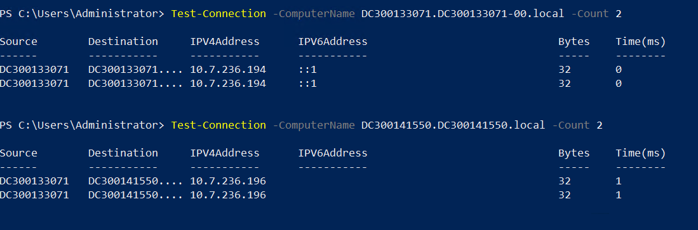
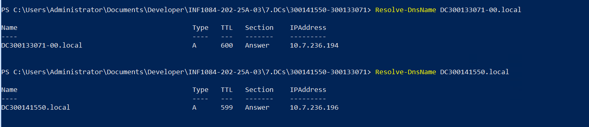

# TP Active Directory – Vérification inter-domaines
---
## Objectif du laboratoire

Ce laboratoire a pour objectif de vérifier la communication et l’accès entre deux contrôleurs de domaine :

- Vérifier la connectivité réseau entre les domaines  
- Vérifier la résolution DNS  
- Récupérer les informations du domaine distant  
- Naviguer dans l’Active Directory distant via un PSDrive  
- Automatiser tous les tests via un script PowerShell  
---
## Étape 1 – Vérifier la connectivité
```powershell
# Vérifier la résolution DNS  
Resolve-DnsName DC300133071.DC300133071-00.local
Resolve-DnsName DC300141550.DC300141550.local

# Vérifier la connectivité réseau entre les domaines 
Test-Connection -ComputerName DC300133071.DC300133071-00.local -Count 2
Test-Connection -ComputerName DC300141550.DC300141550.local -Count 2


```
<table>
  <tr>
    <td></td>
    <td></td>
  </tr>
</table>


## Étape 2 – Informations du domaine distant


