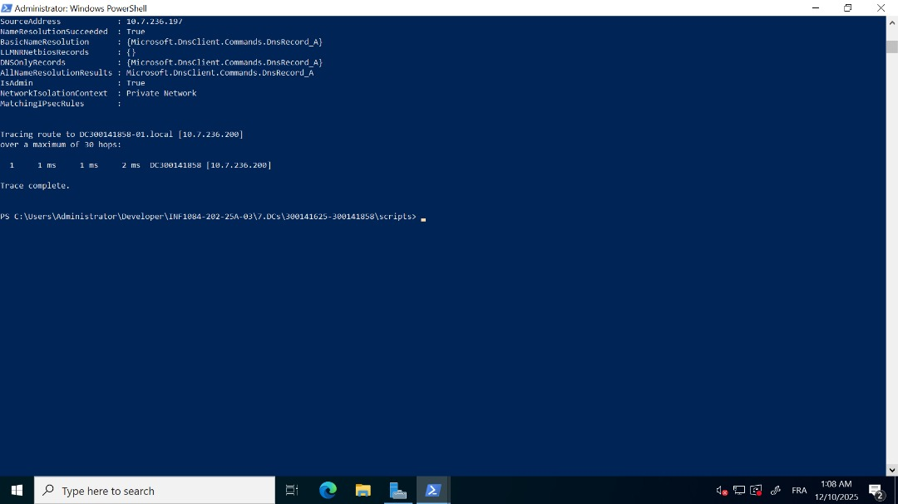
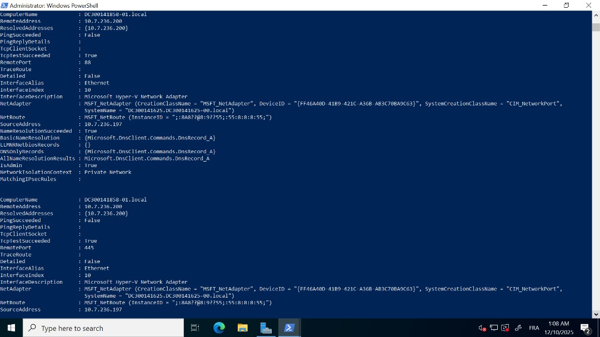
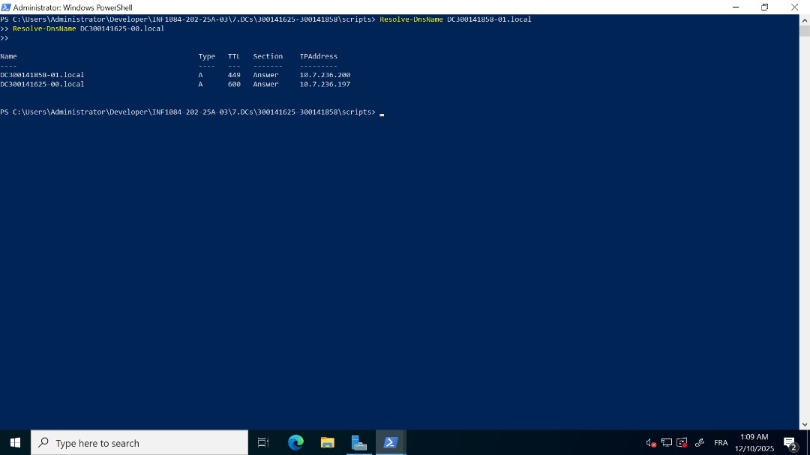
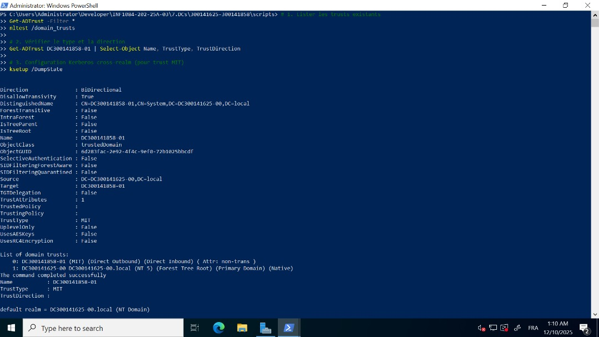
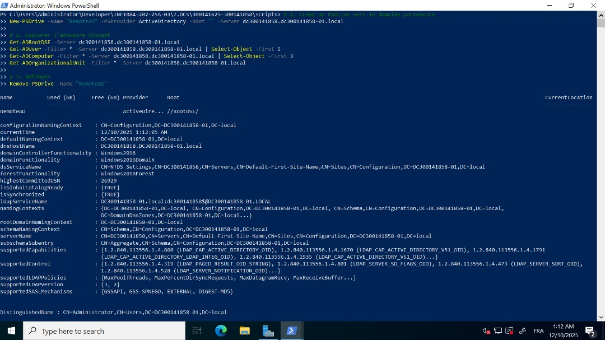

# TP Active Directory – Vérification inter-domaines (REALM ↔ AD)

## 👥 Binôme : 300141625 – 300141858  
## 🌐 Domaine AD : DC300141625-00.local  
## 🔒 Domaine REALM : DC300141858-01  

## Objectif du laboratoire

Ce laboratoire a pour objectif de vérifier la communication et l’accès entre deux contrôleurs de domaine :

- Vérifier la connectivité réseau entre les domaines
- Vérifier la résolution DNS
- Récupérer les informations du domaine distant
- Naviguer dans l’Active Directory distant via un PSDrive
- Automatiser tous les tests via un script PowerShell

---

## Étape 1 – Vérifier la connectivité

Pour vérifier que les deux domaines communiquent, nous avons effectué plusieurs tests `ping`.

Voici les captures d’écran montrant le succès du ping :

---

## Étape 2 – Vérifier la résolution DNS

Nous avons utilisé la commande `nslookup` pour valider la résolution des noms de domaine.

---

## Étape 3 – Créer le trust REALM ↔ AD

Voici la capture montrant la commande `netdom trust` :

---

## Étape 4 – Vérifier le trust

La commande `nltest /trusted_domains` confirme que la relation d’approbation fonctionne :

