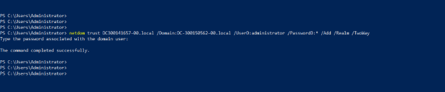
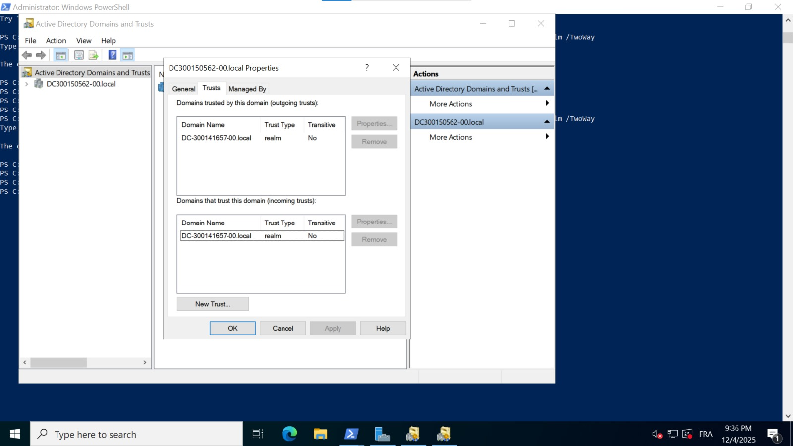
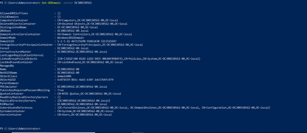

# Trust Active Directory Bidirectionnel

## 📋 Informations

**Cours :** INF1084 | **Établissement :** Collège Boréal  
**Étudiants :** leandre (DC-300141657-00) & corneil (DC-300150562-00)

---

## 🎯 Objectif

Établir un trust Active Directory bidirectionnel pour l'authentification croisée entre deux domaines.

---

## 📊 Domaines Configurés

| Étudiant | Domaine | Adresse IP |
|----------|---------|-----------|
| leandre | `DC-300141657-00.local` | 10.7.236.198 |
| corneil| `DC-300150562-00.local` | 10.7.236.215 |

---

## 🔧 Configuration

### Vérification DNS
```powershell
Resolve-DnsName DC-300141657-00.local
Resolve-DnsName DC-300150562-00.local
```

### Création du Trust
```powershell
netdom trust DC-300141657-00.local /Domain:DC-300150562-00.local `
    /UserD:administrator /PasswordD:* /Add /Realm /TwoWay
```



---

## 📸 Visualisation des Trusts

### Vue Leandre (DC-300141657-00)


**Trusts Visibles:**
- Domaine Sortant: DC-300150562-00.local (Realm, Bidirectionnel)

### Vue Justin (DC-300150562-00)


**Trusts Visibles:**
- Domaine Sortant: DC-300141657-00.local (Realm, Bidirectionnel)

---

## 🖥️ Interrogation du Domaine Distant

### Accès Cross-Domain
```powershell
Get-ADDomain -Server DC-300141657-00.local -Credential $cred
```



**Résultat:** Accès réussi au domaine distant avec authentification croisée
justin a bien access au domaine de frand depuis sa machine virtuelle.

---

## ✅ Résultats de Vérification

| Paramètre | Valeur | Statut |
|-----------|--------|--------|
| Direction | BiDirectional | ✓ |
| Type | Realm | ✓ |
| Transitivité | Non | ✓ |
| Accès Cross-Domain | Fonctionnel | ✓ |

---

## 🔍 Commandes de Vérification

```powershell
# Lister tous les trusts
Get-ADTrust -Filter *

# Vérifier la connectivité
netdom trust DC-300141657-00.local /Domain:DC-300150562-00.local /verify
netdom trust DC-300150562-00.local /Domain:DC-300141657-00.local /verify
```

---

## 📝 Scripts & Documents

- `trusts1..ps1` - Script de rapport leandre
- `trusts2.ps1` - Script de rapport corneil

---

## ✨ Résultat Final

✅ Trust bidirectionnel établi avec succès  
✅ Authentification croisée fonctionnelle  
✅ Communication inter-domaines confirmée  
✅ Accès aux ressources cross-domain validé

