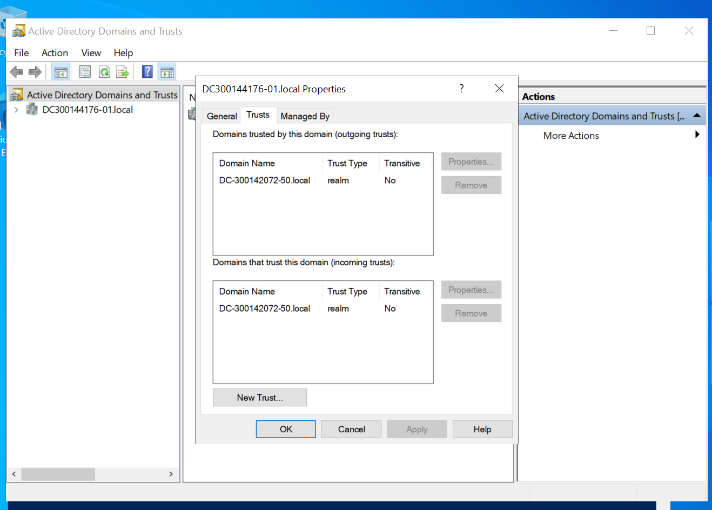

# Trust Active Directory Bidirectionnel

❗Nous avons realise ce travail avec nos adresses ip car siga a rencontre des defis avec son namecheap. Elle a contacte le service client, mais les solutions donnees n'ont pas ete efficaces pour resouldre le probleme.

## 📋 Informations
 
**Étudiants :** Awa (DC-300144176-01 & SIGA (DC-300142072-50)

---

## 🎯 Objectif

Établir un trust Active Directory bidirectionnel pour l'authentification croisée entre deux domaines.


## 🔧 Configuration

### Vérification DNS
```powershell
Resolve-DnsName DC-300144176-01.local
Resolve-DnsName DC-300142072.50 .local
```

### Création du Trust
```powershell
netdom trust DC-300142072.50local /Domain:DC-300144176.01local `
    /UserD:administrator /PasswordD:* /Add /Realm /TwoWay
```


---

## 📸 Visualisation des Trusts

### Vue AWA(DC-300144176)


**Trusts Visibles:**
- Domaine Sortant: DC-300142072-50.local (Realm, Bidirectionnel)

### Vue SIGA (DC-300122072)


**Trusts Visibles:**
- Domaine Sortant: DC-300144176-01.local (Realm, Bidirectionnel)

---

## 🖥️ Interrogation du Domaine Distant

### Accès Cross-Domain
```powershell
Get-ADDomain -Server DC-300142072.50local -Credential $cred
```


**Résultat:** Accès réussi au domaine distant avec authentification croisée
justin a bien access au domaine de frand depuis sa machine virtuelle.

---

## ✅ Résultats de Vérification

 


## 🔍 Commandes de Vérification

```powershell
# Lister tous les trusts
Get-ADTrust -Filter *

# Vérifier la connectivité
netdom trust DC-300144176.01local /Domain:DC-300142072-50.local /verify
netdom trust DC-300142072-50.local /Domain:DC-300144176.01local /verify
```

---

## 📝 Scripts & Documents

- `trusts1..ps1` - Script de rapport AWA
- `trusts2.ps1` - Script de rapport SIGA

---

## ✨ Résultat Final

✅ Trust bidirectionnel établi avec succès  
✅ Authentification croisée fonctionnelle  
✅ Communication inter-domaines confirmée  
✅ Accès aux ressources cross-domain validé


