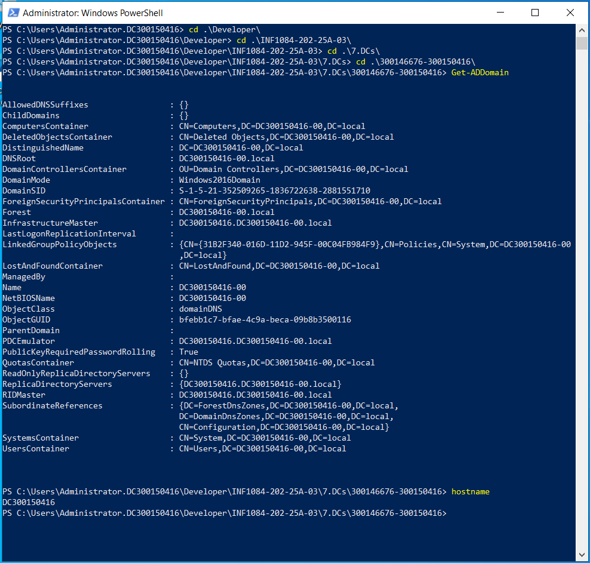
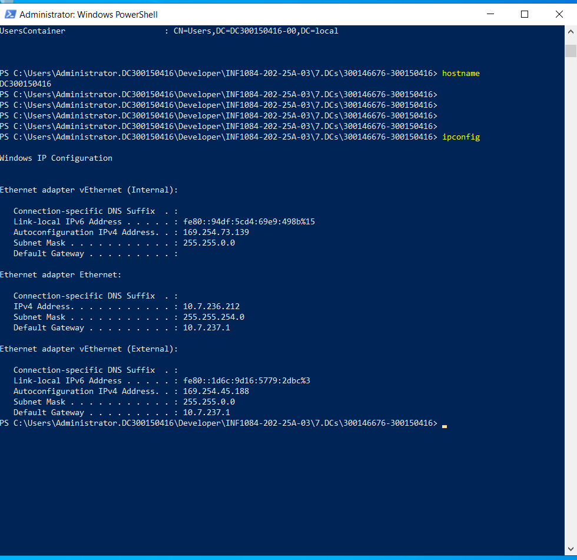
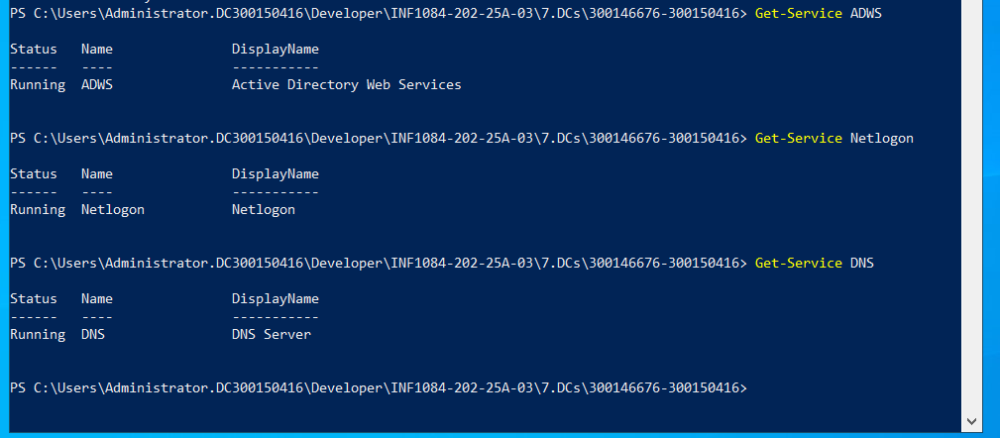
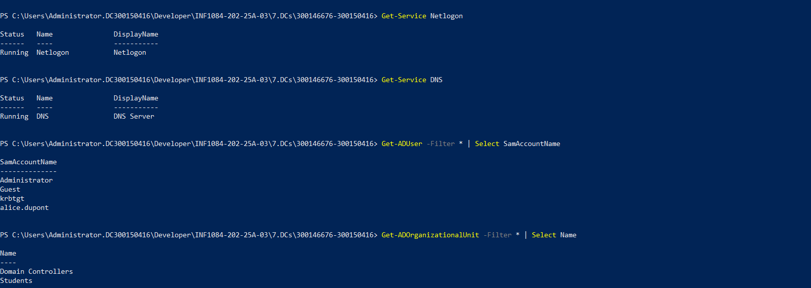
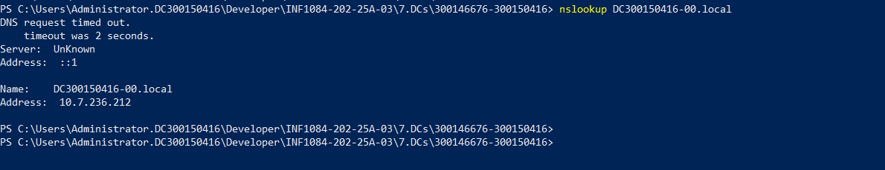
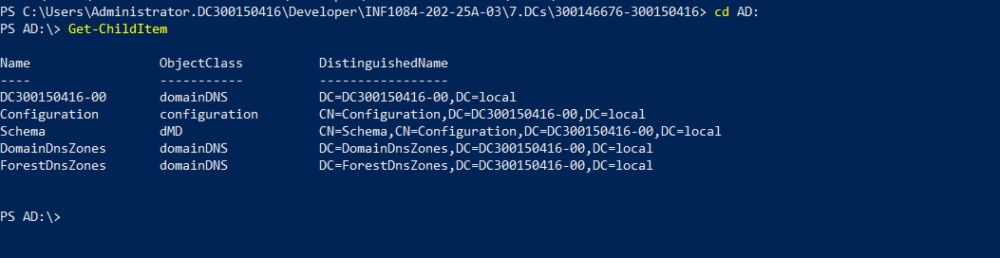
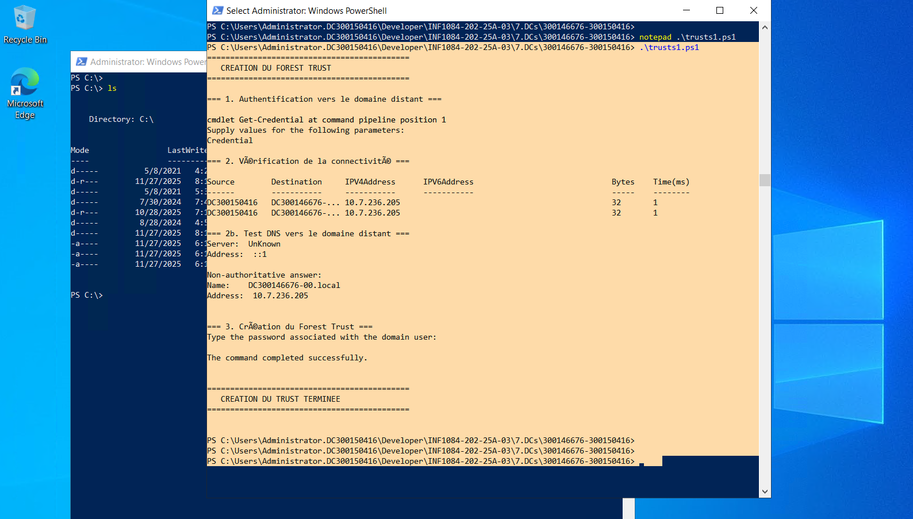

# Projet : Création d’une relation de confiance entre deux forêts Active Directory

**Auteur : Hachem Souyadi**  
**Coéquipier : Harkati Aymen**  
Collège Boréal — INF1084 — Janvier 2025

---

## 🎯 Objectif du projet

Ce projet a pour but de mettre en place une **relation de confiance (Trust)** entre deux forêts Active Directory afin de permettre aux utilisateurs d’un domaine d’accéder aux ressources de l’autre domaine.

Contraintes :
- Aucune interface graphique (GUI)
- Configuration **exclusivement en PowerShell**
- Vérifications DNS et AD nécessaires avant le Trust

---

## 🧱 Architecture du laboratoire

| Serveur | Domaine | Nom de machine | Adresse IP | Rôle |
|--------|---------|----------------|------------|-----|
| **Moi (Hachem)** | DC300150416-00.local | DC300150416 | 10.7.236.212 | Création du Trust |
| **Ami (Aymen)** | DC300146676-00.local | DC300146676 | 10.7.236.xxx | Validation du Trust |

---

## 🧪 1️⃣ Vérification du domaine AD

Commande :
```powershell
Get-ADDomain
hostname
```
📸 Capture :  


---

## 🌐 2️⃣ Vérification réseau et configuration IP

Commande :
```powershell
ipconfig
```
📸 Capture :  


---

## 🔧 3️⃣ Vérification des services essentiels AD

Commandes :
```powershell
Get-Service ADWS
Get-Service Netlogon
Get-Service DNS
```
📸 Capture :  


---

## 👥 4️⃣ Validation des utilisateurs du domaine

Commande :
```powershell
Get-ADUser -Filter * | Select SamAccountName
```
📸 Capture :  


---

## 🏢 5️⃣ Vérification de la structure des OU

Commande :
```powershell
Get-ADOrganizationalUnit -Filter * | Select Name
```
📸 Capture :  


---

## 🔎 6️⃣ Test DNS local

Commande :
```powershell
nslookup DC300150416-00.local
```
📸 Capture :  


---

## 📁 7️⃣ Navigation dans AD via PowerShell Drive

Commande :
```powershell
cd AD:\
Get-ChildItem
```
📸 Capture :  


---

# 🔐 8️⃣ Création de la relation de confiance

💡 Script PowerShell lancé depuis mon serveur

📌 **trusts1.ps1**
```powershell
New-ADTrust `
 -Name "DC300146676-00.local" `
 -SourceForest "DC300150416-00.local" `
 -TargetForest "DC300146676-00.local" `
 -Direction Bidirectional `
 -ForestTransitive $true `
 -Credential (Get-Credential)
```

👉 Ce script va créer un **Forest Trust bidirectionnel**

Les preuves seront capturées lorsque la configuration sera faite avec mon coéquipier.

---

## 🧾 9️⃣ Vérifications prévues après le Trust

| Vérification | Commande |
|-------------|----------|
| Affichage du Trust | `Get-ADTrust` |
| Communication réseau | `Test-Connection DC300146676` |
| Résolution DNS distante | `nslookup DC300146676-00.local` |
| Accès à l’AD distant | `New-PSDrive AD2:` |

📌 Les captures seront ajoutées dans la **version finale du rapport**

---

## 📌 Conclusion intermédiaire

| Élément | Statut |
|--------|:-----:|
| Domaine configuré | ✔️ |
| Services AD opérationnels | ✔️ |
| DNS fonctionnel | ✔️ |
| Environnement prêt pour le Trust | 🚀 |

La partie **validation du Trust** sera réalisée avec mon coéquipier ensuite.

---

## 👨‍💻 Réalisé par

| Nom | Rôle |
|----|-----|
| **Hachem Souyadi** | Configuration et vérifications AD |
| **Harkati Aymen** | Validation du Trust et tests inter-domaines |

---