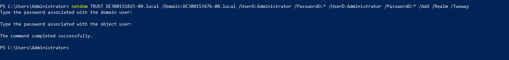
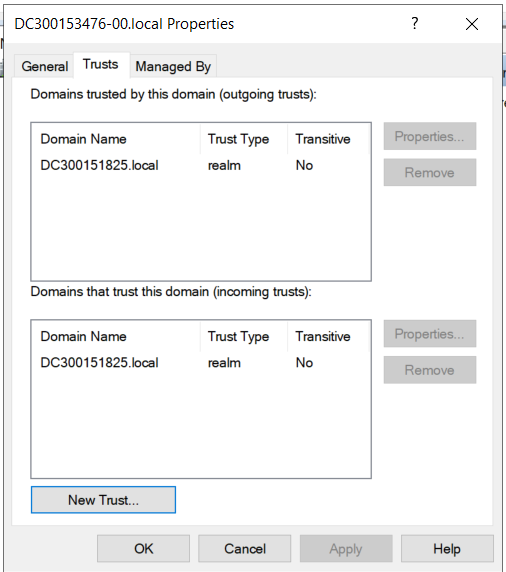
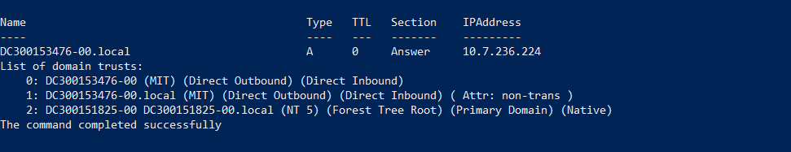

# Trust Active Directory Bidirectionnel

## 📋 Informations

**Cours :** INF1084 | **Établissement :** Collège Boréal  
**Étudiants :** Ramatoulaye (DC300153476-00) & Freedy (DC300151825-00)

---

## 🎯 Objectif

Établir un trust Active Directory bidirectionnel pour l'authentification croisée entre deux domaines.

---

## 📊 Domaines Configurés

| Étudiant | Domaine | Adresse IP |
|----------|---------|-----------|
| Ramatoulaye | `DC300153476-00.local` | 10.7.236.224 |
| Freedy | `DC300151825-00.local` | 10.7.236.217 |

---

## 🔧 Configuration

### Vérification DNS
```powershell
Resolve-DnsName DC300153476-00.local
Resolve-DnsName DC300151825-00.local
```
### Création du Trust
```powershell
netdom trust DC300151825-00.local /Domain:DC300153476-00.local `
    /UserD:administrator /PasswordD:* /Add /Realm /TwoWay
```
 </img>

---

## 📸 Visualisation des Trusts

### Vue Ramatoulaye (DC300153476-00)
 </img>

**Trusts Visibles:**
- Domaine Sortant: DC300151825-00.local (Realm, Bidirectionnel)

### Vue Freedy (DC300151825-00)
 </img>

**Trusts Visibles:**
- Domaine Sortant: DC300153476-00.local (Realm, Bidirectionnel)

---

## 🖥️ Interrogation du Domaine Distant

### Accès Cross-Domain
```powershell
Get-ADDomain -Server DC-300151403-00.local -Credential $cred
```


**Résultat:** Accès réussi au domaine distant avec authentification croisée
justin a bien access au domaine de frand depuis sa machine virtuelle.

---

## ✅ Résultats de Vérification

| Paramètre | Valeur | Statut |
|-----------|--------|--------|
| Direction | BiDirectional | ✓ |
| Type | Realm | ✓ |
| Transitivité | Non | ✓ |
| Accès Cross-Domain | Fonctionnel | ✓ |

---

## 🔍 Commandes de Vérification

```powershell
# Lister tous les trusts
Get-ADTrust -Filter *

# Vérifier la connectivité
netdom trust DC-300143951-00.local /Domain:DC-300151403-00.local /verify
netdom trust DC-300151403-00.local /Domain:DC-300143951-00.local /verify
```

---

## 📝 Scripts & Documents

- `trusts1..ps1` - Script de rapport Frank
- `trusts2.ps1` - Script de rapport Justin

---

## ✨ Résultat Final

✅ Trust bidirectionnel établi avec succès  
✅ Authentification croisée fonctionnelle  
✅ Communication inter-domaines confirmée  
✅ Accès aux ressources cross-domain validé


# FeatFreedy


🛡️ Création et Vérification d’un Trust entre deux forêts Active Directory
(Configuration PowerShell & procédure GUI recommandée par l’enseignant)

# 📌 1. Objectif

L’objectif de ce travail était d’établir une relation d’approbation (trust) bidirectionnelle entre deux forêts Active Directory (DC300151825-00.local et DC300153476-00.local) en utilisant PowerShell et Netdom, comme demandé dans le livrable.

# 📌 2. Étapes suivies
# 🔹 a. Création initiale du trust (GUI – recommandée par l’enseignant)

Cette étape a permis de valider :

la connexion entre les deux domaines

la résolution DNS

la communication entre contrôleurs de domaine

les droits administratifs

la faisabilité du trust

# 🔹 b. Définir les informations d’accès à AD2 (DC300153476-00.local)
```powershell
$credAD2 = Get-Credential -Message "Entrez les identifiants administrateur du domaine DC300153476-00.local"
```

# 🔹 c. Vérifier la connectivité avec le DC de AD2
```powershell
Test-Connection -ComputerName DC300153476-00.local -Count 2
```
# Resultat:
```powershell
Source        Destination     IPV4Address      IPV6Address                              Bytes    Time(ms)
------        -----------     -----------      -----------                              -----    --------
DC300151825   DC300153476-... 10.7.236.224                                              32       2
DC300151825   DC300153476-... 10.7.236.224                                              32       2
```

# 🔹 d. Interroger le domaine AD2
# Informations générales sur le domaine partenaire
```powershell
Get-ADDomain -Server DC300153476-00.local -Credential $credAD2
```
# Resultat:
```powershell
AllowedDNSSuffixes                 : {}
ChildDomains                       : {}
ComputersContainer                 : CN=Computers,DC=DC300153476-00,DC=local
DeletedObjectsContainer            : CN=Deleted Objects,DC=DC300153476-00,DC=local
DistinguishedName                  : DC=DC300153476-00,DC=local
DNSRoot                            : DC300153476-00.local
DomainControllersContainer         : OU=Domain Controllers,DC=DC300153476-00,DC=local
DomainMode                         : Windows2016Domain
DomainSID                          : S-1-5-21-447135690-91861430-3213525697
ForeignSecurityPrincipalsContainer : CN=ForeignSecurityPrincipals,DC=DC300153476-00,DC=local
Forest                             : DC300153476-00.local
InfrastructureMaster               : DC300153476.DC300153476-00.local
LastLogonReplicationInterval       :
LinkedGroupPolicyObjects           : {CN={31B2F340-016D-11D2-945F-00C04FB984F9},CN=Policies,CN=System,DC=DC300153476-00,DC=local}
LostAndFoundContainer              : CN=LostAndFound,DC=DC300153476-00,DC=local
ManagedBy                          :
Name                               : DC300153476-00
NetBIOSName                        : DC300153476-00
ObjectClass                        : domainDNS
ObjectGUID                         : 6e025027-fa10-4753-b3be-04c0c8d96df3
ParentDomain                       :
PDCEmulator                        : DC300153476.DC300153476-00.local
PublicKeyRequiredPasswordRolling   : True
QuotasContainer                    : CN=NTDS Quotas,DC=DC300153476-00,DC=local
ReadOnlyReplicaDirectoryServers    : {}
ReplicaDirectoryServers            : {DC300153476.DC300153476-00.local}
RIDMaster                          : DC300153476.DC300153476-00.local
SubordinateReferences              : {DC=ForestDnsZones,DC=DC300153476-00,DC=local, DC=DomainDnsZones,DC=DC300153476-00,DC=local, CN=Configuration,DC=DC300153476-00,DC=local}
SystemsContainer                   : CN=System,DC=DC300153476-00,DC=local
UsersContainer                     : CN=Users,DC=DC300153476-00,DC=local
```
# Liste des utilisateurs du domaine partenaire
```powershell
Get-ADUser -Filter * -Server DC300153476-00.local -Credential $credAD2
```
# Resultat:
```powershell
DistinguishedName : CN=Administrator,CN=Users,DC=DC300153476-00,DC=local
Enabled           : True
GivenName         :
Name              : Administrator
ObjectClass       : user
ObjectGUID        : 225d08d3-15a2-4df7-b358-001b74a6e348
SamAccountName    : Administrator
SID               : S-1-5-21-447135690-91861430-3213525697-500
Surname           :
UserPrincipalName :

DistinguishedName : CN=Guest,CN=Users,DC=DC300153476-00,DC=local
Enabled           : False
GivenName         :
Name              : Guest
ObjectClass       : user
ObjectGUID        : ca04e43c-5df6-4957-80df-a9fbf2ec2683
SamAccountName    : Guest
SID               : S-1-5-21-447135690-91861430-3213525697-501
Surname           :
UserPrincipalName :

DistinguishedName : CN=student1,CN=Users,DC=DC300153476-00,DC=local
Enabled           : True
GivenName         :
Name              : student1
ObjectClass       : user
ObjectGUID        : 0f1cd06f-2eb4-419e-a523-c25b3feab244
SamAccountName    : student1
SID               : S-1-5-21-447135690-91861430-3213525697-1000
Surname           :
UserPrincipalName :

DistinguishedName : CN=krbtgt,CN=Users,DC=DC300153476-00,DC=local
Enabled           : False
GivenName         :
Name              : krbtgt
ObjectClass       : user
ObjectGUID        : 6062791a-1fa9-4090-b5be-f3487aa86d1f
SamAccountName    : krbtgt
SID               : S-1-5-21-447135690-91861430-3213525697-502
Surname           :
UserPrincipalName :

DistinguishedName : CN=Etudiant1,CN=Users,DC=DC300153476-00,DC=local
Enabled           : True
GivenName         :
Name              : Etudiant1
ObjectClass       : user
ObjectGUID        : c320c3f7-f130-4ea4-a9cb-78c7d532f41b
SamAccountName    : Etudiant1
SID               : S-1-5-21-447135690-91861430-3213525697-1105
Surname           :
UserPrincipalName :

DistinguishedName : CN=Etudiant2,CN=Users,DC=DC300153476-00,DC=local
Enabled           : True
GivenName         :
Name              : Etudiant2
ObjectClass       : user
ObjectGUID        : 8b830a55-fd65-4404-8464-a5408e7c798a
SamAccountName    : Etudiant2
SID               : S-1-5-21-447135690-91861430-3213525697-1106
Surname           :
UserPrincipalName :

DistinguishedName : CN=Ramatoulaye,CN=Users,DC=DC300153476-00,DC=local
Enabled           : True
GivenName         : Diallo
Name              : Ramatoulaye
ObjectClass       : user
ObjectGUID        : cb7902fa-cfe0-4a8d-bd60-343d6e548b41
SamAccountName    : rama.diallo
SID               : S-1-5-21-447135690-91861430-3213525697-1107
Surname           : Bah
UserPrincipalName : rama.diallo@DC300153476-00.local
```

# 🔹 e. Naviguer dans AD2 via PSDrive
```powershell
New-PSDrive -Name AD2 -PSProvider ActiveDirectory -Root "DC300153476-00.local" -Credential $credAD2
Set-Location AD2:\DC=DC300153476-00,DC=local
Get-ChildItem
```
# Resultat:
```powershell
    Directory: C:\Users\Administrator


Mode                 LastWriteTime         Length Name
----                 -------------         ------ ----
d-----         11/6/2025   6:24 PM                .ssh
d-r---         7/29/2024   8:06 PM                3D Objects
d-r---         7/29/2024   8:06 PM                Contacts
d-r---         7/29/2024   8:50 PM                Desktop
d-----         11/6/2025   5:20 PM                Developer
d-r---         7/29/2024   8:06 PM                Documents
d-r---         7/29/2024   8:06 PM                Downloads
d-r---         7/29/2024   8:06 PM                Favorites
d-r---         7/29/2024   8:06 PM                Links
d-r---         7/29/2024   8:06 PM                Music
d-r---         12/6/2025   6:54 PM                Pictures
d-r---         7/29/2024   8:06 PM                Saved Games
d-r---         7/29/2024   8:06 PM                Searches
d-r---         7/29/2024   8:06 PM                Videos
-a----        10/19/2025   6:22 PM            114 .gitconfig
-a----        10/19/2025   6:12 PM             20 .lesshst
-a----        10/19/2025   4:49 PM          12015 .nanorc
-a----         11/6/2025   7:10 PM           1900 .viminfo
```

# 🔹 f. Création du trust en ligne de commande (Netdom)
```powershell
netdom TRUST DC300151825-00.local /Domain:DC300153476-00.local /UserO:Administrator /PasswordO:* /UserD:Administrator /PasswordD:* /Add /Realm /Twoway
```
# Resultat:
```powershell
PS C:\Users\Administrator> netdom TRUST DC300151825-00.local /Domain:DC300153476-00.local /UserO:Administrator /PasswordO:* /UserD:Administrator /PasswordD:* /Add /Realm /Twoway
Type the password associated with the domain user:

Type the password associated with the object user:

The command completed successfully.

PS C:\Users\Administrator>


```
# 🔹 g. Vérification du trust

```powershell
netdom trust DC300151825-00.local /Domain:DC300153476-00.local /Verify
Resolve-DnsName DC300153476-00.local
nltest /domain_trusts
```
# Resultat:
```powershell
Name                                           Type   TTL   Section    IPAddress
----                                           ----   ---   -------    ---------
DC300153476-00.local                           A      0     Answer     10.7.236.224
List of domain trusts:
    0: DC300153476-00.local (MIT) (Direct Outbound) (Direct Inbound) ( Attr: non-trans )
    1: DC300151825-00 DC300151825-00.local (NT 5) (Forest Tree Root) (Primary Domain) (Native)
The command completed successfully
```

# 📌 3. Commandes utilisées

✔ Get-Credential
✔ Test-Connection
✔ Get-ADDomain
✔ Get-ADUser
✔ New-PSDrive
✔ netdom trust
✔ Resolve-DnsName
✔ nltest /domain_trusts

# 📌 4. Les Tests effectués

Test ICMP entre les DC

Vérification DNS

Test Kerberos via NLTEST

Vérification trust via Netdom

Navigation LDAP via PSDrive

Création préliminaire GUI pour valider l’environnement

# 📌 5. Conclusion

Le trust bidirectionnel entre DC300151825-00.local et DC300153476-00.local a été mis en place et vérifié avec succès.
L’utilisation préalable de l’interface graphique, recommandée par l’enseignant, a permis de résoudre les problèmes initiaux avant de reproduire la configuration en PowerShell, comme exigé dans le livrable.
